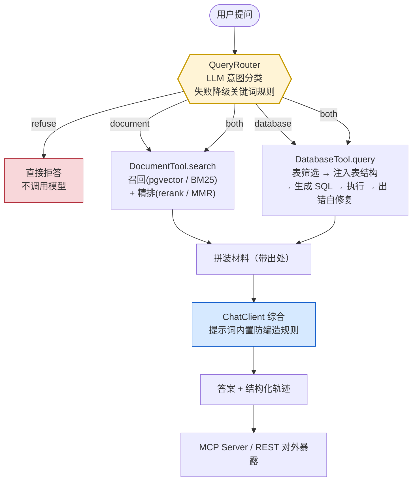

# 识途 Pathwise

> **一句话**：一个会用自然语言回答数据问题的 Agent —— 它自己判断该去**查文档**、**查数据库**，还是**两边都查**，然后把两半拼成一个完整答案。
>
> **名字取自「老马识途」——认得该走哪条路。** 这正是本项目的核心：**把「该走哪条路」当成研究对象**，而不是在 Text2SQL 上顺手加一个查文档的分支。

[](https://openjdk.org/projects/jdk/17/)
[](https://spring.io/projects/spring-boot)
[](https://spring.io/projects/spring-ai)
[](https://www.postgresql.org/)

---

## 目录

- [解决什么问题](#解决什么问题)
- [架构](#架构)
- [核心设计](#核心设计)
  - [1. 路由决策机制](#1-路由决策机制原创点)
  - [2. 双路评测体系](#2-双路评测体系原创点)
- [评测结果](#评测结果)
- [快速开始](#快速开始)
- [项目结构](#项目结构)
- [开源致谢](#开源致谢)

---

## 解决什么问题

在公司里问一句「华东区上季度销售额是多少」，这个问题的答案其实是**劈成两半**的：

- **数字**在数据库里；
- 但「销售额」**到底怎么算**——含不含退货、含不含税、华东怎么划、未完成的订单算不算——写在某份制度文档里。

而本轮你手上能用的工具，只能回答一半：

| 你手上的工具 | 它给你的 | 它给不了你的 |
|---|---|---|
| 只查数据库的 Text2SQL | 一个数字 | 这个数字是按哪个口径算的。**更麻烦的是，它可能就是一个错的算法算出来的，而你完全看不出来** |
| 只查文档的 RAG 问答 | 一段定义 | 具体数字 |

**所以这个项目要做的，是一个「知道答案横跨两边」的系统**：它判断这个问题该去查哪边、需不需要两边都查，然后把两半拼成一个完整回答。

### 和同类项目的区别

调研过这个方向的开源现状：

| 现有项目 | 它们实际怎么做的 |
|---|---|
| SQLBot / WrenAI / DB-GPT / spring-ai-alibaba DataAgent / SuperSonic | 本质都是 Text2SQL。其中的 RAG 只用来召回表名和术语，**不是独立的文档问答** |
| RAGFlow / Spring AI 官方 rag-example | **完全不碰 SQL** |
| LlamaIndex `RouterQueryEngine` + `NLSQLTableQueryEngine` | 唯一原生做多引擎路由的范式，但只有 Python 版，**Java 侧没有等价物** |

**结论：「让 Agent 自己决定走文档检索还是数据库查询」这件事，在开源里是空白。**

对使用者来说这是个缺口；对我来说这是个机会——**空白意味着路由决策和双路评测天然属于原创部分**，而不是把别人的东西重写一遍。

**为什么这两点值得较真**：路由的错误代价是**不对称的**。该查文档却查了库，模型会编一条看起来合理的 SQL、返回一个似是而非的数字，**用户完全无法察觉**；反过来只是答非所问，用户容易发现。评测必须能分辨这两类错误，否则「准确率 90%」这个数字没有意义。

---

## 架构



**核心是那个路由判断**——不是「怎么查」，而是「该走哪条路」。

### 四值路由

路由输出四个值，不是两个：

```
document  答案在制度文档里：口径、定义、规则、流程
database  答案在业务数据里：金额、数量、排名、同比环比
both      两边都需要，缺一个答案就不完整   ← 关键
refuse    不属于以上任何一类，应该明确拒绝而不是硬答   ← 关键
```

`both` 和 `refuse` 是关键：二选一的题，模型永远能选出一个答案（哪怕错）；四选一的题，它才有说「两边都要」和「这题不该用我」的出口。

---

## 核心设计

> 这两块是本项目的原创点。深入的设计推导与实测数据见 [路由失败代价分析](docs/25-路由失败代价分析.md) 与 [评测体系固化](docs/23-评测体系固化.md)。

### 1. 路由决策机制（原创点）

**不是「顺手加了个查文档的功能」，而是把「该走哪条路」当成研究对象**：两条路都摆出来，看 Agent 能不能选对、选错了代价多大。

三个契约在 迭代 8 定下，之后换实现不改调用方：

| 契约 | 字段 | 设计理由 |
|---|---|---|
| `RouteDecision` | `route` / `confidence` / **`reason`** | 四值而非两值；`reason` 是路由失败分析的唯一抓手 |
| `Chunk` | `id` / `content` / **`source`** / `score` | `source` 让答案能标出处，用户才有东西可核实 |
| `QueryResult` | **`sql`** / `columns` / `rows` / `rowCount` | **`sql` 是关键**——让「有没有真查过」可验证 |

路由本身实现了 **5 种策略**并做了对比（迭代 24，28 题）：

| 策略 | 准确率 | 平均延迟 | prompt / compl token |
|---|---|---|---|
| **A** LLM + 数据源清单（**产品路径**） | **0.96 (27/28)** | 1862 ms | 878 / 71 |
| A2 LLM 无清单 | 0.89 (25/28) | 1730 ms | 730 / 66 |
| **B** 关键词规则 | **0.50 (14/28)** | 0 ms | 0 / 0 |
| C 混合（规则优先，不确定转 LLM） | 0.86 (24/28) | 1296 ms | 627 / 50 |
| **D** embedding 原型 | **0.54 (15/28)** | 140 ms | 0 / 0 |

结论：**准确性买不来**。D 比 A 快 13 倍、B 零成本，但准确率只有 0.5 上下——**路由错 = 走错数据源 = 错答案**，这种取舍只在两边准确率接近时才成立。

**关键发现**：`confidence` 字段实测不可用（9 次判断全在 0.95~1.00，同一问题两次跑给出不同值），所以兜底**不能靠置信度阈值**，只能靠「错误代价不对称」——把防线压在唯一危险的误判方向上（`document → database`）。详见 [路由失败代价分析](docs/25-路由失败代价分析.md)。

### 2. 双路评测体系（原创点）

**能同时衡量「路由选对没有」和「答案对不对」，而不是只报一个笼统的准确率。**

一条命令出六类指标：

```bash
mvn spring-boot:run "-Dspring-boot.run.arguments=--sdaq.exp23.enabled=true"
```

产出控制台报告 + `eval/report.md`（人读）+ `eval/report.csv`（每次一行，留历史对比）。

**四值路由就是测试集的 `expected_route` 列**——28 条用例每条都标注了「正确答案该走哪条路」，路由准不准是**确定性**的。

#### 为什么必须分三层

只报一个总分，分不清该改哪儿。实测踩过两次：路由**全对**但答案只有六成有用（[迭代 11](docs/11-路由全对但答案只有六成有用.md)）；以及**混淆矩阵逐格相同、但里面坐的题换人了**，准确率和矩阵都看不见，只有逐题/分组能看见（[迭代 23](docs/23-评测体系固化.md)）。

#### 混淆矩阵比准确率值钱

路由准确率 `0.93` 只是个一维的数；矩阵一看就知道错在哪：

```
期望 \ 实际     document  database  both  none(refuse)
document           13        1        ·        1
database            ·        4        ·        ·
both                ·        ·        4        ·
none                ·        ·        ·        5
```

★ 最该盯的一格是 **`document → database`**——它会产生用户察觉不到的假数字。**「错在哪」和「错了多少」是两个问题，只有一个总数时答不了。**

> 注：内部枚举值是 `REFUSE`，测试集里那一列写的是 `none`，两者在评测代码里显式对齐。同一件事的两个名字。

#### 三个必须记住的噪声边界

评测数字不能乱读——这是本项目花了最多力气守的一条纪律：

- **路由准确率自身噪声 ±1 条 ≈ 0.036**（同一题两次跑出不同路由）→ **小于 2 条的提升不可声称**。
- **端到端跨运行比较前要先扣掉路由摆动**：同一配置 4 次跑 = 0.71 / 0.71 / 0.75 / 0.75，**同配置的摆动比跨配置的差还大**（[迭代 28](docs/28-端到端消融实验.md)）。
- **判分噪声有量级**：同一输入送两次判分差 0.20 → 15 条上的平均差异 **<0.05 不可区分**。

---

## 评测结果

### 基线（`eval/report.md`，28 条用例）

| 指标 | 值 | 说明 |
|---|---|---|
| **路由准确率** | 0.93 (26/28) | 四值分类（document / database / both / none） |
| **端到端正确率** | 0.75 | 用户视角：最终答案对不对 |
| **执行准确率** | 0.38 (3/8) | 数据库支路专用：查出来的数据对不对 |
| 检索 · context 精确率 | 0.66 | LLM 判：召回片段里有多少真的有助于回答 |
| 检索 · context 召回率 | 1.00 | 标准答案的要点有多少能被上下文支持 |
| 生成 · 忠实性 | 1.00 | 答案是否被材料支持 |
| 平均耗时 | 6693 ms | |

⚠️ **执行准确率 0.38 里有 3/8 是测试集自己的缺陷**：B02 / B03 / X04 三道题**题面没有时间范围**，而期望答案默认 2026Q2，模型按「全部期间」答被判错。**数字错了，但错在量具，不在被测对象。**

### 消融实验


| 消融 | 文件 | 最大的一处结论 |
|---|---|---|
| 分块（迭代 13） | [`13`](docs/13-分块对比记录.md) | `chunkSize=300`（再大会让 `XR-2000B` / `XR-2000C` 落进同一片段） |
| 检索 / 融合（迭代 16） | `eval/retrieval-compare.csv` | 混合检索**比单向量差**（hit@1 0.87 → 0.73），参数网格 9 组无一追平 |
| 重排 / MMR（迭代 17） | `eval/rerank-compare.csv` | 精排能补回 RRF 的损失，**补不出超额收益** |
| 表筛选（迭代 19） | `eval/table-select-compare.csv` | hit@8 **20/20**；**BM25 单路性价比最高**（2966 字符 vs hybrid 4220） |
| few-shot（迭代 20） | `eval/fewshot-compare.csv` | 样例 0 / 1 / 3 / 7 条 → 通过 **0 / 4 / 5 / 7** |
| 三档判据（迭代 22） | `eval/text2sql-eval-summary.csv` | 筛表把执行准确率从 **0.11 → 1.00**；可执行率四个配置**全是 0.89**（完全不区分对错） |
| **RAG 五件套（迭代 26）** | `eval/rag-ablation.csv` | **改写让 BM25 +0.166 MRR，对向量 −0.004（等于白花）**；全局最优 `llm+vector+llm` = **0.933** |
| 端到端（迭代 28） | `eval/report.csv` | **去掉混合检索端到端 +0.04，但那 1 条恰好等于路由多对的 1 条** |

#### 最有价值的三条负结果

1. **混合检索（RRF）在文档检索上是负收益，在表筛选上却是正收益** —— 机制同源：**RRF 的前提是「两路可信度相当」**。文档检索上向量 hit@1 0.87 vs BM25 0.67（差 20pp），前提不成立；表筛选上两路接近得多，前提成立。**所以 迭代 16 的结论不是「RRF 不好」，是「RRF 有前提」。**
2. **「我给的 SQL 正确率量具是坏的」** —— 让 LLM 只凭「问题 + SQL」判 SQL 形状，它把 9 条**已知错误**的 SQL 全判满分，却把执行正确的判成错。方向是反的。**可靠的只有「可执行率（确定性）」和「执行准确率（可核对）」两个。**
3. **改写层的收益取决于下游通道** —— 同一个改写，BM25 通道 MRR +0.166，向量通道 **−0.004（等于白花）**。因为改写把口语换成文档用语，而 **BM25 正是只能靠字面重合的那个通道**。→ **「这一层对谁有用」比「这一层有没有用」值钱。**

---

## 快速开始

### 0. 需要什么

Java 17+、Docker、一个 DashScope（阿里云百炼）API Key。

### 1. 起数据库

```bash
# 只起两个库（日常开发用这个）
docker compose up -d
docker compose ps          # 两个都应显示 (healthy)
```

```bash
# 应用 + 两个库一起起（一键跑通，首次 build 实测约 6 分钟）
docker compose --profile full up -d --build
docker compose ps          # 等 sdaq-app 显示 (healthy) 再发请求
```

> **`Started` ≠ `healthy`**：容器刚启动就发请求会报「基础连接已经关闭」，Spring Boot 起来还要十几秒。
> **业务库的初始化脚本只在数据卷为空时执行一次**。要整体重建用
> `docker compose rm -sf business-db` + `docker volume rm smart-data-qa_business_data`，
> **别用 `docker compose down -v`**——那会把 pgvector 的数据一起清掉。

### 2. 设置 API Key

```powershell
# Windows PowerShell（setx 只对新开的终端生效）
setx AI_DASHSCOPE_API_KEY "sk-你的key"
```

```bash
# macOS / Linux
export AI_DASHSCOPE_API_KEY="sk-你的key"
```

### 3. 环境自检 + 冒烟测试

```powershell
powershell -ExecutionPolicy Bypass -File .\scripts\verify-env.ps1

mvn spring-boot:run "-Dspring-boot.run.arguments=--sdaq.smoke.enabled=true"
```

> **注意那个引号。** PowerShell 会把不加引号的 `-Dxxx=yyy` 从中间拆开，Maven 会报 `Unknown lifecycle phase`。
> 用 IDEA 跑时，这个参数填在运行配置的**「程序实参」（Program arguments）**里，**不是「活动配置文件」**。

### 4. 启动并提问

```bash
mvn spring-boot:run
```

启动后有三种用法：

**REST**

```powershell
# 单轮（走缓存）
Invoke-RestMethod -Method Post -Uri http://localhost:8080/chat `
  -ContentType "application/json; charset=UTF-8" `
  -Body ([Text.Encoding]::UTF8.GetBytes('{"question":"华东区上季度销售额是多少"}'))

# 多轮（带 sessionId，走会话表；指代消解自动完成）
# GET /health · DELETE /chat/{id}
```

> PowerShell 里 `curl` 是 `Invoke-WebRequest` 的别名，`-s` / `-H` / `-d` 会报错——要用 `curl.exe` 或 `Invoke-RestMethod`。

**MCP Server**——`http://localhost:8080/mcp`（Streamable HTTP），暴露三个工具：

| 工具 | 层次 | 用途 |
|---|---|---|
| `ask_data_question` | 高层 | 完整问答，返回答案 + 路由决策 + 结构化轨迹 |
| `search_documents` | 低层 | 只要文档片段原文 |
| `query_database` | 低层 | 只要查询结果 + 实际执行的 SQL |

任何 MCP 客户端（Claude Desktop、IDE 插件等）都能直接接入。接入方法见 [MCP 接入说明](docs/10-MCP接入说明.md)。

> ⚠️ **诚实标注**：MCP 自 迭代 10 之后**没有端到端再验过**，而之后两条支路全变了。
> **所以「别人可以接入」这句话需要一次真实客户端调用才算数**——这是检查点②里列为「必须兑现」的待办。

**课程里的各天 Demo**——每天一个开关，默认全关：

```powershell
mvn spring-boot:run "-Dspring-boot.run.arguments=--sdaq.exp24.enabled=true"
```

全部 20 多个开关见 [`docs/PROJECT-STATE.md`](docs/PROJECT-STATE.md)。

---

## 项目结构

```
smart-data-qa/                    # 仓库名（项目代号「识途 Pathwise」，仓库名与 Java 包名沿用早期命名）
├── docker-compose.yml            # 两个数据库容器（+ app 在 full profile 里）
├── Dockerfile
├── docs/
│   ├── PROJECT-STATE.md          # ★ 活快照：当前进度 / 全部开关 / 实测发现索引 / 技术坑表
│   └── NN-*.md                 # 每天的实验记录（含负结果与被推翻的结论）
├── eval/
│   ├── testset.csv               # 28 条评测用例（含 expected_route 四值）
│   ├── report.md / report.csv     # 一条命令出的六类指标
│   └── *-compare.csv             # 各次消融的原始数据
├── scripts/
│   ├── static-check.py           # 九类静态自检（沙箱里没有 JDK，靠它兜底）
│   └── gen-charts.py           # 改数据不用改图
└── src/main/java/com/example/smartdataqa/
    ├── router/                   # 路由契约与 5 种策略
    ├── tools/                    # 两条支路（corpus / vector / hybrid / rerank / text2sql）
    ├── rag/pipeline/             # 显式五层 RAG pipeline
    ├── agent/                    # Agent 主干 + 各阶段演示
    ├── eval/                     # 评测脚手架 + LLM 判分
    ├── trace/                    # 结构化轨迹（4 个类）
    ├── service/                  # 答案缓存 + 会话编排
    ├── web/ mcp/                 # REST + MCP 两套对外入口
    └── config/ context/ util/
```

规模：94 个 Java 文件 · 6 份语料（约 5100 字，19 个向量片段）· 业务库 20 张表 / 18 条外键 · 测试集 28 条。

---

## 开源致谢

本项目是**自研主干 + 参照架构**，不是任何项目的 fork 或改名套壳。

- **架构参照** [spring-ai-alibaba/DataAgent](https://github.com/spring-ai-alibaba/DataAgent)（Apache-2.0）——参考了它的 StateGraph 编排、RAG 增强、HITL 与 MCP Server 暴露方式。**只读架构，未复制代码**；本项目在它的思路上补上了它没有的两样东西：**文档工具分支**与**路由决策节点**（DataAgent 本质仍是 Text2SQL）。
- **积木参考** [spring-ai-alibaba/examples](https://github.com/spring-ai-alibaba/examples)（Apache-2.0）——重点参考了其中的 **nl2sql**（表结构注入与 SQL 生成的提示词组织）、**rag**（advisor 与检索装配）、**tool-calling**（`@Tool` 与工具注册）、**graph**（节点与状态传递）、**evaluation**（判分器接入方式）五个示例模块。用途是**「这三件事该怎么用 Spring AI Alibaba 的 API 做」**，具体实现全部重写。
- **框架** [Spring AI](https://github.com/spring-projects/spring-ai) 1.1.0 与 [Spring AI Alibaba](https://github.com/alibaba/spring-ai-alibaba) 1.1.0.0（均 Apache-2.0）。
- **学习资料** [Hello-Agents](https://github.com/datawhalechina/hello-agents) · [learn-claude-code](https://github.com/shareAI-lab/learn-claude-code)。

> 选型的完整依据（为什么开源里没有现成方案、各候选仓库的许可证结论、为什么自研而不是 fork）见 [选型调研](docs/选型调研.md)。

### 本项目的许可

[](LICENSE)

**MIT**——随意取用。参照的 DataAgent 与 examples 均为 Apache-2.0，本项目**只读架构、未复制代码**，因此不受其许可约束；提及它们是因为**该说清楚思路来自哪里**。

---

## 记录在案的实测发现

这个项目最花力气的部分不是写功能，而是**「跑出来的」和「我以为的」之间的差距**。全部近 70 条实测发现按主题整理在 [`docs/PROJECT-STATE.md`](docs/PROJECT-STATE.md) 的「实测发现」表里。几条代表性的：

- [模型自述与事实的偏离](docs/模型自述与事实的偏离.md) —— 摘要污染、编造过程、进度条骗人、**置信度不可用**
- [框架拿走了拦截点](docs/06-框架拿走了拦截点.md) —— 用框架的代价
- [路由误判会污染答案](docs/08-路由误判会污染答案.md) —— 一次误判怎么变成答案里一个没人问过的数字
- [路由全对但答案只有六成有用](docs/11-路由全对但答案只有六成有用.md) —— 指标和体验的差距
- [SQL 安全边界](docs/21-SQL安全边界.md) —— 「验证拦住了」必须**独立去看表还在不在**，不能听工具自己说
- [端到端消融实验](docs/28-端到端消融实验.md) —— 端到端的差可能是**路由摆动**冒充的

**贯穿的一条主线**：最危险的错误都是**不报错的**那些。
