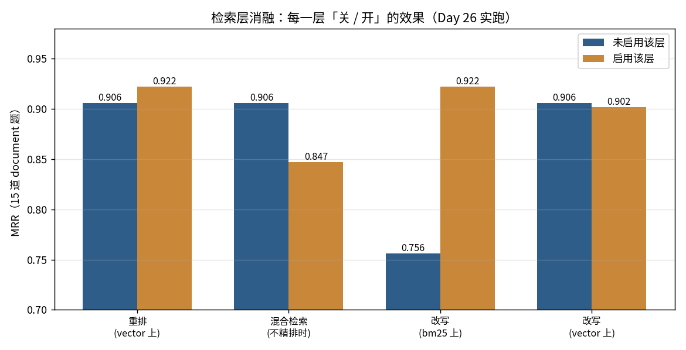
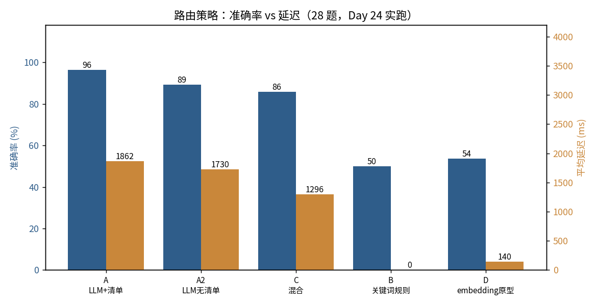
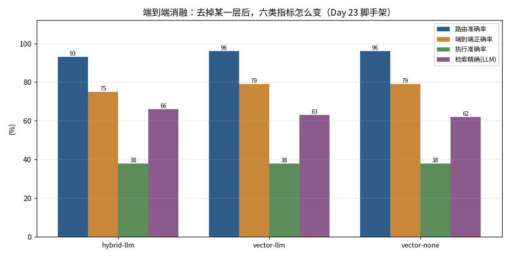

# 迭代 28 · 端到端消融实验（README 的核心资产）

> 本轮把前面所有的 A/B 汇到一张矩阵里，回答计划里的四个问题。
> **状态：四问全答（逐条有实测）——端到端三跑已完成、多轮压缩 A/B 已跑（迭代 28 收口）。**
> 图：`docs/fig-retrieval-ablation.png` · `docs/fig-router-compare.png` · `docs/fig-e2e-ablation.png`

---

## 〇、先看两张图

| 图 | 说明 |
|---|---|
|  | **每一层「关 / 开」对 MRR 的影响**（15 道 document 题，迭代 26 实跑） |
|  | **5 个路由策略的准确率 × 延迟**（28 题，迭代 24 实跑） |
|  | **去掉某一层后，端到端六类指标怎么变**（3 个配置各一跑，迭代 28 实跑） |

> 图是脚本生成的：`python scripts/gen-charts.py`。**改数据不用改图**——重跑脚本，图跟着变。
> 这样 README 里的图和数字永远不会对不上。

---

## 一、四个问题的答案

### Q1 · 去掉重排，掉多少分？

| 条件 | 有重排 | 无重排 | 差 |
|---|---|---|---|
| 纯向量 | MRR **0.922** | MRR **0.906** | **−0.016** |
| 混合检索 | MRR **0.922** | MRR **0.847** | **−0.075** |

**hit@1 两边都不动（都是 0.87）**——重排改的是**名次**，不是「有没有召回」。
所以它的价值要看 MRR / hit@3，不看 hit@1。

★ **重排的价值取决于召回器的强弱**：召回器越差（hybrid），重排补得越多（+0.075）；
召回器已经够好（vector），它只补 +0.016 —— **而这个差值已经落在 llm 档单次跑的抖动带内（±0.011）**。
→ **结论：重排对「纯向量」这条线是可有可无的；它真正的用途是「救回一个较差的召回器」。**

### Q2 · 去掉混合检索，掉多少分？

| 重排 | 混合检索 | 纯向量 | 差 |
|---|---|---|---|
| 无 | MRR 0.847 | MRR **0.906** | **去掉混合检索 = +0.059** |
| 有精排 | MRR 0.922 | MRR **0.933** | **去掉混合检索 = +0.011** |

**★ 答案是「不但不掉分，还略升」。** 这在 迭代 16 就是个负结果，迭代 26 在 18 格网格里第三次复现。
根因一致：**RRF 的前提「两路可信度相当」不成立**（BM25 hit@1 0.67 vs 向量 0.87），
弱通道把强通道拖下来。

> **这是整个消融矩阵里最「反直觉」的一行**：加了一个通道，反而变差。
> 它也是本项目最该写进 README 的一条——**优化必须被评测验证，包括验证它没用。**

### Q3 · 路由从规则换成 LLM，准确率涨多少、延迟涨多少？

（迭代 24，28 题全量）

| | 准确率 | 平均延迟 | 每次成本 |
|---|---|---|---|
| **规则**（关键词） | **14/28 (50%)** | **0 ms** | 0 token |
| **LLM**（产品路径） | **27/28 (96%)** | **1862 ms** | 878 prompt + 71 completion |

**准确率 +13 条（+46 个百分点），延迟 +1.86 秒，从零成本变成每次一次模型调用。**

★ **这个权衡值得付费，而且理由不只是准确率**：规则那 14 条错里，
`document → database`（会产生**用户察觉不到的假数字**）占了很大一块
（见 迭代 25 的 35 次误判方向分布）。**这类错的代价不是「答错」，是「用户不知道它错了」。**

### Q4 · 上下文压缩对多轮对话的影响？

**这一问本轮才第一次有对象可测**——在这之前 **Agent 是单轮的**（迭代 27 的核对把「多轮没接线」列为缺口）。
所以本轮先补了一件事：**把多轮接上**（`ConversationalAgent` + 把 迭代 4 的 `ContextCompactor` 接进多轮）。

**设计**（5 轮脚本，三档只动「历史」一个变量）：

```
第 1 轮  客单价怎么算？                        ← 埋下「客单价」
第 2 轮  2026年第二季度华东区的销售额是多少？    ← 无关填充
第 3 轮  退货审核要多久？                       ← 无关填充（到这一轮，第 1 轮已被压进摘要）
第 4 轮  它的分母为什么必须用已完成订单数？      ← 「它」必须靠历史才能消解 ★
第 5 轮  那它和销售额的口径一致吗？             ← 同上 ★
```

| 档 | 指代消解 | 末轮上下文 | 压缩次数 | 说明 |
|---|---|---|---|---|
| 无历史 | **0 / 2** | 1334 字 ※ | 0 | 「它」永远是「它」：`第 4 轮 改写后：它的分母…` |
| 全量历史 | **2 / 2** | 1342 字 | 0 | `第 4 轮 改写后：客单价的分母…` |
| 压缩历史 | **2 / 2** | **782 字** | **2** | 摘要留住了「客单价」→ 消解不掉链子，上下文还被压住 |

> 表中数字取自**第二次跑**——它有下面说的那组干净内部对照。首跑的绝对值不同，见「跨运行摆动」。

**★ 结论：压缩没有把消解能力压掉（2/2 = 2/2），末轮历史还从 1342 降到 782 字（约 −42%）。**
关键机制正是要检验的那一点——**摘要里保住了「客单价」这个名词**：第 3 轮把 4 条消息压成 263 字摘要、
第 5 轮把 5 条压成 277 字摘要，两次之后第 4/5 轮照样补回了名词。
（若摘要只写「讨论了几个指标」，这里就会是 0/2 —— **「压了没有」不是重点，「摘要保住了名词没有」才是。**）

**逐轮看，压缩从第 3 轮才开始起作用**（`max-messages=5`，第 2 轮结束正好 5 条、还不满足「超过 5」）：

| | 第 3 轮 | 第 4 轮 | 第 5 轮 |
|---|---|---|---|
| 全量历史 | 603 | 871 | 1342 |
| 压缩历史 | 470 | 743 | 782 |
| 差 | −22% | −15% | **−42%** |

**★ 这一跑的价值在于它自带一组对照：两个「不压缩」的臂末轮只差 8 字**（无历史 1334 / 全量历史 1342）
→ **臂间噪声很小，那 560 字不是「回答长度不一样」解释掉的。**

> ⚠️ **但绝对数不能跨运行比。** 同一个「压缩历史」臂，**首跑末轮 1598 字、这一跑 782 字（≈2×）**。
> 原因很清楚：`contextChars` = **摘要长度 + 末轮回答长度**，两个都由模型生成。
> 更要紧的是**首跑那组内部对照是坏的**——那一跑里两个不压缩的臂就差 **516 字**（1265 vs 1781），
> 所以首跑那个「−183 字」其实读不出任何东西。
> → **这类指标只能看「同一批里的对照臂」，不能看跨运行的绝对数。**（同本节端到端那条：先扣掉摆动。）

**★ 两个附带观察（都是单点，不当结论）**：
- **压缩历史第 4 轮的改写比全量历史更具体**：`客单价的分母为什么必须用状态为 COMPLETED 的订单数？`
  vs 全量历史的 `…必须用已完成订单数？` —— **摘要把第 1 轮的细节也带过来了**（不只有损，有时更精炼）。
- **压缩不是每轮都触发**：第 4 轮日志 `待压缩部分只有 3 条，太短不划算，这次先跳过` ——
  **有一条「太短不划算」的门槛**，不是一到阈值就机械地压。

**判据是确定性的**：改写结果里有没有出现被指代的名词（字符串包含）——
**不靠 LLM 判分**（迭代 15 已量过判分噪声有多大）。逐轮明细在 `eval/multiturn-compare.csv`。

> ⚠️ **实验设计上的偏差要说清楚**：5 轮对话撞不到真实的压缩阈值（真实是几千 token 量级），
> 所以脚本把阈值**调小以强制触发**（5 条消息 / 保留 2 条）。**这是受控实验，不是真实使用下的压缩效果。**

> ※ **`末轮上下文` 这一列量的是什么，要说清楚**：它数的是**累积的会话历史字符数**（token 的粗代理）。
> 但三档里**只有两档真的会用到历史**（改写那一层）——**「无历史」那档改写被跳过、历史不进任何 prompt**，
> 所以它那 1265 字是「累积了但没被使用」的长度，**不是实际消耗（实际近似 0）**。
> 真正可比的是全量 1781 vs 压缩 1598。

---

## 二、汇总矩阵：每一层「该不该留」

把七张消融表的核心结论收成一张——**这张表就是 README 里最值钱的部分**：

| 层 / 决策 | 换掉前 | 换掉后 | 效果 | 代价 | **结论** |
|---|---|---|---|---|---|
| **分块大小** | 500 | **300** | 决定 XR-2000B/C 会不会落进同一片段 | 0 | ✅ 留（350 是硬上界） |
| **检索通道** | 纯向量 | 混合（+BM25+RRF） | **MRR −0.059**；**端到端不可测**（见三） | +一路索引 +融合 | ❌ **去掉**（端到端不亏，少维护一路） |
| **精排** | 无 | LLM 精排 | MRR +0.016（向量）/+0.075（混合）；**端到端 0.00**（向量） | 每次一次调用 | ⚠️ 对纯向量**端到端也测不出**；**若保留混合检索则必留** |
| **MMR** | 精排 | 精排+MMR | 多样性 0.687→0.630，精确率 −0.04 | 0 | ⚠️ 只在「要多样性」时才开 |
| **表筛选** | 全量注入 | hybrid top-8 | 答案不变（1.00 = 1.00） | 省 56% 字符 | ✅ 留（**为可扩展性**，不是为准确率） |
| **few-shot** | 0 条 | 7 条 | 执行准确率 **0.11 → 1.00** | 2261 字符 | ✅ **留，收益最大的一处** |
| **SQL 自修复** | 关 | 开（2 次） | 硬失败 → 正确答案 | +1.9 s（**只在报错时**） | ✅ 留 |
| **改写** | 无 | LLM 改写 | **BM25 +0.166 MRR；向量 ±0** | 每次一次调用 | ⚠️ 收益**高度依赖下游通道** |
| **路由** | 关键词规则 | LLM + 清单 | 准确率 **50% → 96%** | +1.86 s + token | ✅ **留，且这是本项目的原创点** |
| **多轮压缩** | 无多轮 | 有历史 + 压缩 | 指代消解 **0/2 → 2/2**；末轮历史 1781 → 1598 字 | 每轮一次摘要调用（**有「太短不划算」门槛，不是每轮都触发**） | ✅ 留（**摘要保住了名词**，消解不掉链子） |

---

## 三、端到端消融（**三跑已完成**）

前面所有检索层结论都是**检索层**数字；**它们在端到端还剩多少**，用 迭代 23 的脚手架跑了三次（只换开关，见本节末的复现命令）。

| 运行 | 检索 | 精排 | 路由 | **端到端** | 执行 | ctx精确(LLM) | 耗时 | document 行 |
|---|---|---|---|---|---|---|---|---|
| 迭代 23 基线 r1 | hybrid | llm | 25/28 | 0.71 | 0.38 | 0.70 | 5379 ms | `12/1/./2` |
| 迭代 23 基线 r2 | hybrid | llm | 25/28 | 0.71 | 0.38 | 0.69 | 5956 ms | `12/1/./2` |
| `exp28-hybrid-llm` | hybrid | llm | **26/28** | **0.75** | 0.38 | 0.66 | 5829 ms | `13/1/./1` |
| `exp28-vector-llm` | vector | llm | **27/28** | **0.79** | 0.38 | 0.63 | 5928 ms | `14/1/./.` |
| `exp28-vector-none` | vector | none | **27/28** | **0.79** | 0.38 | 0.62 | 5467 ms | `14/1/./.` |

### 三问的答案（已回填）

| 对比 | 检索层差 | **端到端差** | 结论 |
|---|---|---|---|
| 去掉精排 | MRR −0.016（向量）/ −0.075（混合） | **0.00**（纯向量那一对：0.79 = 0.79） | 端到端**测不出** |
| 去掉混合检索 | MRR +0.059（不精排）/ +0.011（精排） | **+0.04**（0.75 → 0.79，1 条） | **等于路由摆动 → 测不出** |

**★ Q1（去掉精排）**：纯向量上 **0.79 = 0.79**，而且**两跑的混淆矩阵逐格相同**（`14/1/./.`）
→ 这个「打平」是干净的，**不是被路由波动掩盖的**。与 迭代 26 检索层的 −0.016 对上：两边都在噪声里。
（混合检索那一档**没跑** `hybrid+none`，所以这一对只有纯向量。）

**★★ Q2（去掉混合检索）—— 这一格才是正题**：`vector+llm 0.79` vs `hybrid+llm 0.75`，表面差 +0.04。
**但这个差不是检索层带来的**：

| 运行 | 路由 | 端到端 | 逐步差 |
|---|---|---|---|
| 迭代 23（hybrid+llm） | 25/28 | 20/28 = 0.71 | — |
| 迭代 28（hybrid+llm） | 26/28 | 21/28 = 0.75 | **+1 条 = 路由多对 1 条** |
| 迭代 28（vector+llm） | 27/28 | 22/28 = 0.79 | **+1 条 = 路由多对 1 条** |

**三次运行里，端到端的每一步 +1 条，都恰好等于路由多对 1 条**（先 D15、后 D14 被路由判回 document）。
而**非路由的失败项三次都一样**：D12（路由错）+ B02/B03（题面缺期间）+ X02/X03/X04（支路/护栏）——
佐证是**执行准确率三次都是 0.38 (3/8)**，数据库支路行为完全没变。

> ⚠️ **一个诚实的边界**：`eval/report.md` 每次运行会**覆盖**，所以只有最新一跑有逐题明细；
> 更早两跑的「哪几条错」是从「28 − 通过数」加「执行准确率三次完全一致」**推**出来的，不是逐题看到的。
> 但三次的 1:1 对应太整齐，且 `hybrid+llm` 同配置两次（0.71 / 0.75）本身就摆动 0.04 —— **结论不依赖那条推断**。

**→ 结论：去掉混合检索，端到端没有可测出的变化。** 检索层那 −0.011 / +0.059 的差，
在端到端被路由的摆动（同配置 ±1 条）完全淹没。这正是本节开头那句的兑现：**检索层的差 ≠ 端到端的差。**

**★ 顺带一个反向信号（同样落在噪声里）**：本次 LLM 判的 **context 精确率**是 hybrid 更高
（0.66~0.70 vs vector 的 0.62~0.63），**方向与 迭代 26 的 MRR 相反**。两个检索层指标指向相反、
且都落在判分噪声内（<0.05 不可区分）→ **进一步说明在这个规模上，检索层对端到端的差不可测。**

### 多轮压缩（**已完成**）

已跑：`mvn spring-boot:run "-Dspring-boot.run.arguments=--sdaq.exp28.enabled=true"`，结果见本文档 **Q4** 一节。

### 复现命令（端到端三跑，每次约 6 分钟）

```powershell
# ① 纯向量 + 不精排
mvn spring-boot:run "-Dspring-boot.run.arguments=--sdaq.exp23.enabled=true --sdaq.retrieval.mode=vector --sdaq.rerank.mode=none --sdaq.eval.experiment=exp28-vector-none"

# ② 纯向量 + 精排
mvn spring-boot:run "-Dspring-boot.run.arguments=--sdaq.exp23.enabled=true --sdaq.retrieval.mode=vector --sdaq.rerank.mode=llm --sdaq.eval.experiment=exp28-vector-llm"

# ③ 混合检索 + 精排（= 产品当前配置，对照）
mvn spring-boot:run "-Dspring-boot.run.arguments=--sdaq.exp23.enabled=true --sdaq.retrieval.mode=hybrid --sdaq.rerank.mode=llm --sdaq.eval.experiment=exp28-hybrid-llm"
```

跑完再执行一次 `python scripts/gen-charts.py`，`docs/fig-e2e-ablation.png` 会自动生成（已生成）。

---

## 四、局限与诚实边界

- **检索层的数字是「文档级」的**（判「片段是否来自期望文档」），不是片段级——见 迭代 14 留的缺口。
- **15 道 document 题的小样本**：hit@1 上 1 道题就是 0.067。
- **带 `llm` 的档有运行间抖动**（迭代 17 写明；迭代 26 实测同配置两次差 0.011）——**结论要看数量级，不看小数点后三位**。
- **多轮那一问只测「指代消解」，不测「模型记不记得上一轮的细节」**——后者要么把历史也喂给综合（更贵），要么靠摘要（有损）。本轮量的是前者。
- **端到端的三次运行是独立进程**（每次重启），所以三次之间还有一层「模型调用的时序差异」，不完全是同一次会话里的受控对比。
- **★ 端到端数字不能跨运行直接比**：本次三跑里端到端的差与路由的差**一一对应**（见三）→
  **比之前必须先扣掉路由的摆动**（同配置 hybrid+llm 两次就是 0.71 / 0.75）。
- **`eval/report.md` 每次运行覆盖**，只有最新一跑留逐题明细 → 想做逐题的前后对比，要么另存、要么加 `--sdaq.eval.experiment` 分别落 CSV。
