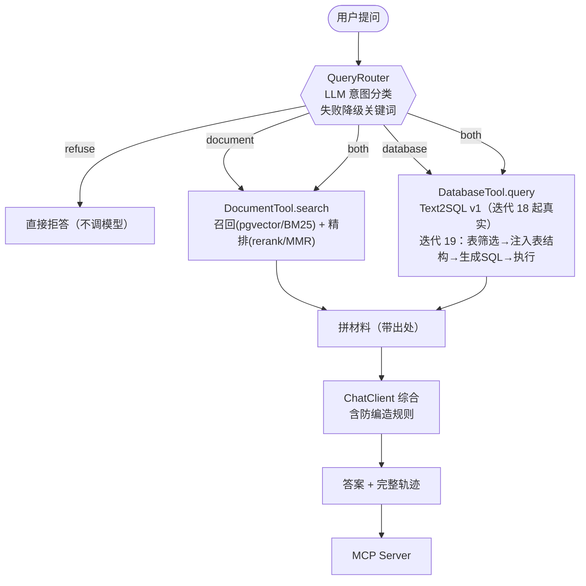

# 项目当前状态（快照）

> **最近更新 （迭代 29 实跑通过：编译 + 轨迹 + 缓存；REST/Docker 待验）**
> **这份是「从零接手」用的快照。新会话开始时先读它，不用重读全部历史。**

---

## 一句话

一个 **Agent 自主路由「文档检索」与「数据库查询」** 的智能数据问答助手。

**原创点在于「路由决策本身」**：开源里数据问答类项目本质都是 Text2SQL（其中的 RAG 只做表名召回），
RAG 类项目完全不碰 SQL，没人把「该走哪条路」当研究对象。Java 侧尤其空白。

---

## 位置与技术栈

```
项目根目录：D:\smart-data-qa
文档：      同目录下 docs/
语料：      src/main/resources/corpus/（6 份，约 5100 字，已入库）
```

| | |
|---|---|
| 语言 / 构建 | Java 17 · Spring Boot 3.5.7 · Maven |
| Agent 框架 | Spring AI 1.1.0 + Spring AI Alibaba 1.1.0.0 |
| 模型 | DashScope 通义千问 `qwen-plus`（`AI_DASHSCOPE_API_KEY` 环境变量） |
| 存储（**已接入**） | PostgreSQL 16 + pgvector（5432，迭代 14）· PostgreSQL 16 业务库（5433，**迭代 18 起 20 张表**，迭代 19 扩表） |
| 对外暴露 | MCP Server，WebMVC 版，Streamable HTTP，`http://localhost:8080/mcp` |

规模：94 个 Java 文件 · 28 份文档 · 6 份语料 · 业务库 20 张表 / 18 条外键 · 测试集 28 条（`eval/testset.csv`）

**检索支路的两个正交开关**（任意一轮的基线都能一键复现）：
`sdaq.retrieval.mode` = vector | bm25 | hybrid ｜ `sdaq.rerank.mode` = none | llm | mmr

**数据库支路的开关**：`sdaq.database.mode` = text2sql | mock（默认 text2sql，`mock` 回到 迭代 8—17）。
**表筛选**（迭代 19）：`sdaq.table-select.mode` = none | bm25 | vector | hybrid（默认 hybrid，`none` 回到 迭代 18）。
**few-shot / 自修复**（迭代 20）：`sdaq.text2sql.few-shot-size`（默认 **7**，**已由消融定值**：0/1/3/7 条 → 0/4/5/7 通过）
｜ `sdaq.text2sql.repair-attempts`（默认 **2**，只在报错时才动）。

**Text2SQL 支路评测**（迭代 22）：`sdaq.exp22.enabled`（诊断跑，见 `docs/22-Text2SQL支路评测.md`）
→ 产出 `eval/text2sql-eval.csv`（逐题）与 `eval/text2sql-eval-summary.csv`（每个「集合 × 配置」一行）。
判据分**三档**：可执行率（确定性）· SQL 正确率（LLM 判意图，新增 `LlmJudge.gradeSqlIntent`）·
执行准确率（用户关心的那个）。

**评测报告**（迭代 23）：`sdaq.exp23.enabled` → **一条命令出六类指标**（路由准确率 + 混淆矩阵 / 检索 / 生成 / 执行准确率 / 端到端正确率），
产出 `eval/report.md`（README 用）+ `eval/report.csv`（一次报告一行，留历史对比）。见 `docs/23-评测体系固化.md`。
⚠️ **别与 `sdaq.exp15.enabled` 同时开**（两个 runner 都跑 28 条）。

**路由策略对比**（迭代 24）：`sdaq.exp24.enabled` → 28 题 × 5 策略（A LLM+清单 / A2 LLM无清单 / B 关键词 / C 混合 / D embedding原型），
比 **准确率 × 延迟 × 成本(token)**；产出 `eval/router-compare.csv`。¥ 单价可配（`sdaq.router-bench.price-per-1k-*`，**默认 0 = 不折算**）。
见 `docs/24-路由v2多策略对比.md`。

**显式五层 RAG pipeline**（迭代 26）：`sdaq.rag.pipeline.enabled`（默认 **false** = 走原有装配，pipeline 照建不接）
｜ `sdaq.rag.rewrite.mode` = `none` | `llm`。消融跑 `sdaq.exp26.enabled` → `eval/rag-ablation.csv`。
见 `docs/26-模块化RAG五件套.md`。

**安全边界**（迭代 21）：`sdaq.business-db.max-rows`（默认 1000，JDBC 层截断）
｜ `query-timeout-seconds`（默认 15）｜ `sdaq.text2sql.masked-columns`（默认 `customer_name,employee_name,phone,mobile,email,id_card,bank_card,address`）。
准入护栏 `SqlGuard` **不允许被关掉**（`Options` 紧凑构造器兜底）。

**对外服务**（迭代 29）：`sdaq.cache.enabled`（默认 **true**）｜ `sdaq.cache.max-entries`（200）｜ `sdaq.cache.ttl-seconds`（600）
｜ `sdaq.memory.enabled`（true）｜ `sdaq.memory.max-sessions`（100）。
**REST**（新增）：`POST /chat`（不带 sessionId = 单轮、走缓存；带 = 多轮、走会话表）· `DELETE /chat/{id}` · `GET /health` · `GET /`。
**Docker**：`docker compose --profile full up -d --build` 一条命令起「应用 + 两个库」；**不带 profile 就还是只起两个库**（老用法没变）。
⚠️ **缓存在服务层（`QaService`），不在 `SmartQaAgent` 里** —— 评测路径走不到它，所以历史基线不受影响（这条是推理，待实跑证伪，见 `docs/29-工程化.md` 第六节）。

> ⚠️ **以上都是「代码侧」的开关。数据侧没有开关。**
> `docker/init-business-db-extra.sql`（扩表到 20 张）**还没执行**，所以库现在仍是 5 张表，
> 迭代 18 的基线还活着（迭代 20 的 `n=0` 逐位复现了 0/7/2）。
> **但那脚本一执行，迭代 18 的基线就再也回不来了**——代码侧有 `mode` 可切，数据侧没有。

**⚠️ 从 迭代 14 起，应用启动需要 pgvector 在跑**（`docker compose up -d pgvector`）——
`PgVectorStore` 这个 bean 创建时就要连库建表。旧 demo 也起不来（它们只是用 mock 检索，
但容器里的 bean 照样要装配）。

**⚠️ 从 迭代 18 起，数据库支路默认要真查业务库**（`docker compose up -d business-db`）。
但**启动本身不需要业务库在线**——业务库的连接是懒的（`BusinessDb` 用 `DriverManagerDataSource`，
构造时不建连接；表结构也是第一次渲染时才读）。只有真正走 database 支路才会失败，
而且是「如实上报失败」，不是崩。

---

## 架构（当前实际接线）



**四值路由**：`document` / `database` / `both` / `refuse`。
其中 `both` 和 `refuse` 是关键——二选一的题模型永远能选出一个答案（哪怕错），
四选一的题它才有说「两边都要」和「不该用我」的出口。

**已实现但还没接入主链路**：`ContextCompactor`（迭代 4）、`ToolRegistry` 权限门（迭代 5）、
`Plan` 可校验计划（迭代 5）。各自有独立演示，接入时间点见 `docs/architecture.md`。

---

## 进度

| 阶段 | 状态 |
|---|---|
| **阶段一 地基**（迭代 1—5） | ✅ 环境 · 手写 Agent 循环 · ReAct · 上下文压缩 · 权限门与计划 |
| **阶段二 骨架**（迭代 6—11） | ✅ Spring AI 化 · Advisor / 结构化输出 / 流式 · 双支路骨架 · LLM 路由 · MCP · **检查点① 通过（路由 10/10）** |
| **阶段三 RAG 支路**（迭代 12—17） | ✅ **完成**。12 语料 · 13 分块 · 14 向量检索 · 15 评测基线 · 16 混合检索（负结果）· 17 重排与 MMR（**收口**）。三组对比数字都在 `docs/17-重排与MMR.md` 第七节 |
| **阶段四 Text2SQL**（迭代 18—22） | **进行中**。**迭代 18 ✅ 已实跑**（0/7/2）。**迭代 19 ✅ 验收达成（扩表后实跑）**：20 张表下四模式 **hit@8 全 20/20**、覆盖率自检两向 `[OK]`；**BM25 单路性价比最高**（2966 字符 / 精确 0.415，比 hybrid 少 1254 字符、hit 一样）；**RRF 融合在这里是有用的（和 迭代 16 相反，机制同源）**。**迭代 20 ✅ 已实跑**（few-shot 消融 0/4/5/7 通过；自修复验收通过）。**迭代 21 ✅ 已实跑**（三次跑全绿，抓出四个 bug 全修）。**迭代 22 ✅ 已实跑（库已扩到 20 张表）**：支路集执行准确率 `exp18-form 0.11 → no-filter/filtered/full 1.00`；筛表对答案无影响但省 56% prompt；端到端执行准确率 0.38（**失败里 3/8 是题面缺期间**）。详见 `docs/22-Text2SQL支路评测.md` |
| 阶段五 路由与评测（迭代 23—27） | ✅ **完成，检查点② 通过**（四件套逐条核对，见 `docs/27-检查点②投递就绪.md`）。迭代 23 报告 / 迭代 24 五策略 / 迭代 25 代价分析 / 迭代 26 五件套消融 / **迭代 27 核对 + 阶段小结** |
| 阶段六 优化与包装（迭代 28—30） | **进行中**。**迭代 28 ✅ 四问全答**（端到端的差全来自路由摆动；多轮压缩 2/2、摘要保住名词）。**迭代 29 ✅ 四件事全部实跑通过 + 全部未验项已关闭**：编译 · 结构化轨迹 · 答案缓存 · 多轮 REST · **Docker 一键起 + 容器内真问答** · 「缓存不污染基线」· 多轮压缩体积收益（−42%）。**下一步 迭代 30（包装 / README）** |

### 提交习惯（⚠️ 别踩这个坑）

**用户每天收尾时提交**。所以：

- **不要假设几天的工作堆在工作区**；
- **不要用文件 mtime 推断「未提交」**——提交过的文件时间戳一样是新的（我就这么误判过，
  还建议用户 `git add -A`，那会把不相关的东西一起卷进去）；
- 要确认就**让用户跑 `git status`**（沙箱不能跑 git，见技术坑表）。

### 迭代 13 那批改动的历史教训（价值在于错误本身，不在错误）

上一版快照在这里写过「静态检查通过」——**那句话是错的**。
那批改动的初版**编译不过**，实跑 `mvn` 报了**四处错误**：

1. `CorpusLoader` 把 `loadAll()` 改成了 `loadDocuments()`，返回类型也从 `List<Chunk>` 变成
   `List<Document>`，但 `CorpusDemo` 还在调 `loadAll()`——**这个方法已经不存在**
2. `MockDocumentTool` 删掉了无参构造器，但 `SkeletonDemo` 和 `RouterCompareDemo`
   还在 `new MockDocumentTool()`（两个调用点）
3. `DocumentChunker` 用了 `TokenTextSplitter` 的 **6 参构造器**（带 `punctuationMarks`）——
   那是 **1.1.3 才加的**，1.1.0 根本没有这个重载
4. `CorpusDemo` 第 4 组改写后调了 `shortenId(...)`，**但这个方法从来没被写出来**
   （旧代码走的是 `showSearch(...)`）——纯粹的悬空引用
5. （**不是编译错误，是实跑才看得见的**）`ChunkingExperimentDemo` 里有一行日志的 `{}`
   写在自己那一行、参数却传在下一行，SLF4J 原样打印出字面量 `{}` 并把参数吞掉——已修

**三条教训：**

- 沙箱没有 JDK，「静态检查」只能查括号和拼写，**查不出签名不一致**。
  凡是跨文件改了签名（改方法名、改构造器参数、删重载），**必须把所有调用点过一遍**。
- 上面第 4 条更隐蔽：它**不在任何一次「改名」里**，是自己新写的调用忘了配实现。
  所以静态自检还必须单独扫一遍「**本类内被无前缀调用、但本文件没有定义的方法名**」——
  这个扫描在沙箱里可用脚本做（见技术坑表最后一行）。
- 上面第 5 条**编译能过、静态扫描也扫不到**，只有跑起来看日志才发现。
  原因是 `{}` 和它的参数被写在了**不同的 log 语句**上。所以占位符检查必须
  **按语句配对**：数一数这条 `log.xxx(...)` 里的 `{}` 和它自己的参数个数。
  同类检查还有：日志里的参数顺序是否与文案一致（顺序错了不会有任何报错）。

---

## 核心契约（三个，迭代 8 定下，换实现不改调用方）

| 契约 | 字段 | 设计理由 |
|---|---|---|
| `RouteDecision` | `route` / `confidence` / **`reason`** | 四值而非两值；`reason` 是路由失败分析的唯一抓手 |
| `Chunk` | `id` / `content` / **`source`** / `score` | `source` 让答案能标出处，用户才有东西可核实 |
| `QueryResult` | **`sql`** / `columns` / `rows` / `rowCount` | **`sql` 是关键**——让「有没有真查过」可验证，是 迭代 21 防线的落点 |

**⚠️ `confidence` 字段实测不可用**：9 次判断全在 0.95~1.00，同一问题两次跑给出不同值。
所以 迭代 25 的兜底策略**不能靠置信度**，只能靠「错误代价不对称」。

---

## 实测发现（面试素材，全在 docs/）

这些是**跑出来的**，不是推演出来的。按「偏离方式不同、修法也不同」组织：

| 发现 | 一句话 | 文档 |
|---|---|---|
| 摘要污染 | 模型把助手的建议当成用户的要求 | `模型自述与事实的偏离.md` |
| 编造过程 | 声称做过没做过的事（「我打过电话」） | 同上 |
| 进度条骗人 | 工具没执行，却报告完成 | 同上 |
| **置信度不可用** | 模型说不出「我不确定」 | 同上 |
| 路由误判污染答案 | 误判成 both → 答案里多了个没人问过的数字 | `08-路由误判会污染答案.md` |
| **路由全对但答案六成有用** | 指标和体验的差距；评测要分三层 | `11-路由全对但答案只有六成有用.md` |
| 框架拿走拦截点 | 用框架的代价，Advisor 补不上 | `06-框架拿走了拦截点.md` |
| **分块边界不可靠** | 切分器把 `.` 当句号，于是切在版本号 `v3.0` 中间 | `13-分块对比记录.md` |
| **向量分不开近似编码** | `XR-2000B` / `XR-2000C` 落进同一片段，得分只差 **0.000662** | `14-向量检索接通.md` |
| **召回变好、精确率反而略降** | 命中率 4/5→5/5，但平均精确率 0.52→0.48；向量把「相关但不回答问题」的片段排到了前面 | 同上 |
| **相似度分数挤在一起** | 有一题 top5 全在 0.526~0.564，跨度仅 **0.0378** —— 阈值兜底走不通 | 同上 |
| **路由不知道「我手上有什么」** | 28 条错 3 条，全是同一个病：模型断言「语料里没有」，而语料里其实有（D10 说 XR-2000B 不在文档里、D14 说福建归属是「地理常识」） | `15-评测基线.md` |
| **★★ 手写的提示词清单会悄悄过期，一过期路由就凭印象判「我手上没有」** | 路由提示词里那份「数据源能力」是硬编码的：文档库列 **4 份**（实际 6 份）、业务库写着「订单表，含…」——**那是 5 张表时代的描述**，迭代 18 扩表后一直没改。迭代 23 的混淆矩阵把后果照出来了：3 处路由错**全是「模型断言手上没有、而其实有」**（D10 在语料 05、D12 在 06、D14 在 02），且**与 迭代 15 逐题相同**。★ 又一个「不响的错」——提示词写错不会有任何报错。修法：清单改成运行时从 `CorpusLoader` / `SchemaRenderer` 读。 | `23-评测体系固化.md` 第六节 |
| **★ 混淆矩阵比准确率值钱（迭代 23 实证）** | 基线路由 **0.89** 只是个一维的数；矩阵一看就知道：3 处错**全部从 document 掉出去**——其中 **1 条落进 database（最坏方向，会产生不可察觉的假数字）**、2 条落进 refuse。**「错在哪」和「错了多少」是两个问题，只有一个总数时答不了。** 也正因为矩阵把方向指清楚了，才能一眼看出「该修的是提示词里的清单」 | 同上 5.2 |
| **★★ 路由误判不是均匀撒在四个方向上的（迭代 25 汇总实测）** | 5 策略 28 题合计 **35 次误判**：**`document→database` 17 次（唯一每个策略都犯的，含最强的 A 唯一那条错）**、`document→refuse` 13、其余 4 类共 4 次；**`database→document`、`refuse 硬答` 一次都没出现**。→ **兜底该压在这一个方向上，不是四面平均。** ★ 但「没出现」只能读成「还没看到」——`database/both/none` 只有 4/4/5 条，10% 错率不会显形（缺证据≠没风险） | `25-路由失败代价分析.md` 一、二 |
| **★★ `both` 不是安全牌（迭代 8 实测，迭代 25 正式收进代价表）** | 定义题「销售额是怎么算的」被误判成 `both` → 答案里多了一句「例如…销售额为 **128,450,000 元**」——**数字真实、出处正确、模型没骗人**，但用户问的是口径，却读到一个没问过的数字且**很难察觉**。→ **误判成 both 的后果不是「答案更全」，是「答案里出现用户没问的内容」**。把 both 当兜底，等于用一种不可察觉的错换另一种 | 同上 二、四（C） |
| **★★ 最隐蔽的假数字【不在路由层】，在支路的口径层** | 迭代 18 的 D4：**多算 740 万（漏状态过滤）− 少算 900 万（跨期那单）= 67,760,000，正确 69,360,000，只差 2.3%**——**两个方向相反的错互相抵消**。路由判对、SQL 跑通、SQL 也附在答案里了，**仍然无人能察觉**。→ **「附 SQL 让用户可核对」防得住编造，防不住口径错**；兜底不能只修路由 | 同上 三（修正 2） |
| **★ 「按危险方向调置信度阈值」在本项目走不通** | 计划给的示范答案要按方向设阈值，但**置信度没有区分度**：迭代 9 九次全 0.95~1.00；迭代 15 同题两次不同路由、给的还是 0.95；迭代 24 28×5 次里最低 0.90。→ **阈值卡在哪儿都拦不住东西**。缺的是**可用的信号**，不是更聪明的阈值。替代设计：对落在危险方向上的判定做**一次定向复核**（只问「要数字还是要定义」），代价约 +14% 路由 token / +0.26 s | 同上 三（修正 1）、四（B） |
| **★★ 「给模型一份清单」治不了全部：清单给的是【标题】，不是【覆盖范围】** | 迭代 23 让路由读真实语料标题 + 表名后重跑：**修好 D10、弄坏 D15、净效果 0**（路由 0.89 → 0.89）。机制：D10 的答案在《产品线与编码规则》——**标题恰好提示内容** → 找到；D15 的答案在《数据仓库使用说明》（T+1 延迟）——**标题不提示「实时性」** → 模型带着清单逐条找、找不到"像"的，**反而更有底气地拒答**。**两个方向的错是同一个病根：模型只能凭「名字」判断手上有没有，不是凭「内容」。** 下一步（迭代 24）：清单写「标题 + 一句内容提示」 | `23-评测体系固化.md` 6.5 |
| **★★ 连混淆矩阵都看不见「换血」——必须逐题（或分组）** | 迭代 23 改路由前后，**混淆矩阵逐格相同**（document 行都是 `12/1/./2`），因为**格子计数一样、只是哪道题坐在格子里换了**（基线错 D10/D12/D14；改后错 D12/D14/D15）。准确率看不见、矩阵也看不见。**但分组能**：`精确编号 0.00→1.00`、`语义 0.71→0.57`。→ **「评测要分层」的第四次兑现：只报总分的评测，会把「一条修好、一条弄坏」读成「什么都没发生」。** | 同上 6.5 |
| **判分噪声有量级** | 同一输入送两次判分差 **0.20**（= 1 个片段 / 5）→ 15 条上的平均差异 **<0.05 不可区分**。本轮所有 context 列的对比都在噪声里 | 同上 |
| **手写编排 vs 教科书版没拉开差距** | 同一批 15 道 document 题：0.80 vs 0.73，**且差距来自提示词措辞（我写了「回答简洁」）而非能力**；修完 bug 重跑后两者都是 0.73 | `15-评测基线.md` |
| **路由是非确定性的** | 同一题两次跑出不同路由（D15：DOCUMENT → REFUSE，且给的还是 0.95 置信度）→ **`route_accuracy` 自身噪声 ±1 条 ≈ 0.036**；小于 2 条的路由提升不可声称 | 同上 |
| **语义族的问题折在路由上，不是检索上** | 语义族 7 条答案只有 0.57（其余各族全 1.00），**但失败的 3 条全是路由错、检索根本没跑** → **迭代 16 混合检索救不了它们** | 同上 |
| **混合检索在这个规模上是结构性负收益** | hit@1 **0.87 → 0.73**，且**参数网格 9 组无一追平**。**`k` 从 10 到 60 数字完全一样**——数学必然：两路融合时顺序≈按「名次之和」，k 只决定近似并列；候选数加到 20 **反而更差**（一对平庸名次能压过单路里的好名次）。根因是 **RRF 的前提「两路可信度相当」不成立**（向量 0.87 vs BM25 0.67） | `16-混合检索与RRF.md` |
| **确定性指标被真验过** | 新旧两版代码、两次跑，`vector`/`bm25`/`hybrid-c5-k60` 三行**逐位一致**——「同分按 id 定序」那两处没白做 | 同上 |
| **精排能补上 RRF 的损失，但补不出收益** | `hybrid+none` hit@1 **0.73 → 0.87**（加 llm 精排后追平纯向量），但 MRR 0.911 仍 < `vector+llm` 0.922 → **关键词通道在 19 片段上本身就没价值，怎么融合都是负的** | `17-重排与MMR.md` |
| **精排和 MMR 是取舍、不是叠加** | llm 精排让多样性**下降**（0.675→0.687，更聚集，因为最相关的常是同一份文档的相邻片段）；MMR 让它降到 0.630 但精确率掉 0.04 | 同上 |
| **精排也犯「相关但不回答问题」** | 变差的 2 题（D07/D11）都是把《01-口径说明》的片段提到了前面——**和 迭代 14 向量犯的是同一个病**，说明这是「语义相似度」判据本身的局限 | 同上 |
| **文档级指标回答不了片段级问题** | 迭代 14 留的「关键词能否分开 XR-2000B/C」在 迭代 16 测不出来——两路在这一题都是「文档级命中」，因为两个型号本来就在同一份文档里 | 同上 |
| **mock 的标准答案是编造的、而且看不出来** | 迭代 15 测试集里 `database` / `both` 用例的期望值是 mock 硬编码的 `128,450,000`。迭代 18 接真实库后重算为 `36,100,000`（区域排名也从 3 个变 6 个）——**两个数字在文档里长得完全一样**，只有换到真实数据源才分得出来。**这正是 迭代 4「编造过程」的又一个样本：连我自己都编过** | `18-Text2SQL原理与Schema注入.md` 第六节 |
| **模型猜错的是「取值」，不是表结构** | 迭代 18 首次跑 Text2SQL：4/9 道题返回 0 行，全因为把 `'华东'` 写成 `'华东区'`（**照抄了问题里的说法**）。SQL 合法、执行成功、**数据库一声不响**。表结构注入给了表/列/类型/可空/主键/外键/注释，**唯独没给「列里存了哪些值」**——这是本次第一大失分点，也是我事先完全没预料到的（我预判的坑是「选错列」） | 同上 |
| **8/8 道涉及期间的题都用了 `created_at`** | `completed_at` 的列注释白纸黑字写着「订单完成时间，未完成时为 NULL」，模型**照旧全选了 `created_at`** → 2026Q2 华东 27,300,000（正确 36,100,000）。**「该用哪一列」表结构里真的看不出来**——预判被实证，且 100% 命中率说明这不是偶发 | 同上 |
| **两个错误互相抵消 → 反而更像对的** | D4 全国合计：多算了 740 万（漏状态过滤）− 少算了 900 万（跨期那一单）= 67,760,000，而正确是 69,360,000，**只差 2.3%**。只看最终数字，绝无可能发现里面有**方向相反的两个错**。这是「不响的错」里最难的一档 | 同上 |
| **「0 行」和「1 行 NULL」不是一回事** | `AVG()` 作用在 0 行上返回的是 **1 行 NULL**（不是 0 行）：`rowCount = 1` 看着像查到了，值却是 NULL。实跑当场把 NULL 渲染成字面量 `NULL`（原来渲染成空串，两者在日志里看不出区别） | 同上 |
| **「错误的正确形式」比字段名写错隐蔽得多** | D7 问福建省销售额，模型**知道**去 JOIN `region_provinces`（外键标注起作用了），但 `region → province` 是一对多，按省份过滤**根本不缩小订单集合**——即使省份名写对，返回的也是整个华东。它最后返回 0，只是因为取值也写错（`'福建省'`）——**两个错误叠在一起，让一个口径错误的查询看起来像是在正确地报告「库里没有数据」** | 同上 |
| **按「响不响」分类比按「对错」分类有用** | 迭代 18 9 道题：**0 通过、7 失败、2 人工**，但 SQL 几乎全都合法、全都执行成功。失败全在「不响的错」那一侧，其中「返回 0 行」这一档最毒——**D1/D5/D6 是真的取值写错、D8 是该查归档表，但在日志里长得一模一样**，「查不到」和「查法错了」无法区分 | 同上 |
| **★同一个技术用在第二个地方** | 迭代 16 为文档检索写的 `Bm25Index` 与 `RrfDocumentJoiner`，迭代 19 拿来做表筛选——**两个类一行都没改**。变的只有「被检索的东西」：文档片段 → 表目录条目（一表一条）。能复用不是巧合，是因为当初它们只要求输入是「有 id、有正文、能排序的东西」，而这本来就是 `Document` 的定义。**「理解原理」和「照教程抄步骤」的差别就在这儿** | `19-表筛选复用混合检索.md` 第二节 |
| **★表注释会变成检索磁铁** | 我给 `payments` 写「回款记录（销售额是净额口径，不等于实际收到的钱）」，本意是把语料 01 的知识塞进 schema——结果**所有问「销售额」的题它都排第一**，把 `orders_archive` 挤出 top-8，T05 直接漏表。**删掉夹带的业务解释后 top-8 从 19/20 → 20/20。** 原因：表注释有两个用途、而要求相反——给模型看要写清含义，**给检索当语料要短、且只说自己**。业务含义本来就该放文档 | 同上 第六节 |
| **K=8 是召回饱和点 —— 复现值被实跑逐位证实** | 沙箱逐行复刻的 BM25 K 扫描（11/17/18/**20**）在实跑里**一模一样**（K=1/3/5/8）。默认 `top-k: 8` 是数据定的不是拍的；K 开宽不心疼，因为**漏一张表那道题就必错**。→ **「没 JDK 也能先在沙箱算一遍」这条路被验证过** | 同上 第五、5.4 节 |
| **★★ 同一个 RRF：这里有用，文档检索上有害 —— 机制同源** | 表筛选（20 张表）里 `hybrid` 在**每个 K** 都不低于 `bm25`（12≥11…20=20），除 K=1 外也不低于 `vector`。这和 迭代 16「混合反而更差」**看似矛盾、实则同因**：迭代 16 的根因是 **RRF 的前提「两路可信度相当」不成立**（文档 hit@1 向量 0.87 vs BM25 0.67，差 20pp）；**表筛选两路接近得多**（K=1 时 11 vs 13）。**前提成立→融合帮忙，前提不成立→融合添乱。** *（反过来说：迭代 16 的结论不是「RRF 不好」，是「RRF 有前提」）* | `19-表筛选复用混合检索.md` 5.4 发现 2 |
| **★★ 改写层有效，但收益【高度依赖下游通道】（迭代 26 消融）** | 配成对看 MRR：**BM25 通道 0.756 → 0.922（+0.166）**、hit@1 **0.67 → 0.87（+0.20）**；而**向量通道 0.906 → 0.902（−0.004，等于白花）**；hybrid 居中。机制清楚（日志有原文）：改写把口语换成文档用语（`客户退的钱什么时候少算` → `退货金额扣减时点`），**而 BM25 正是只能靠字面重合的那个通道**；向量本来就在做同义改写，不需要帮忙。→ **「这一层对谁有用」比「这一层有没有用」值钱** | `26-模块化RAG五件套.md` 5.2 |
| **★★ 「显式改造」的合法性靠两条独立证据（迭代 26）** | 把「套娃式装配」改成显式五层 pipeline，**如果行为变了，所有历史基线都会跟着漂且不报错**。所以 demo 先跑**纯重构回归检查**：`rewrite=none` 时逐题比对新旧装配的**片段 id 序列** → **90 次比对 0 次不一致**。另有独立佐证：`none+vector+none` MRR **0.906**、`none+hybrid+none` **0.847**，与 迭代 16/17 数字**逐位一致**。★ 回归检查**只比 none/mmr**——llm 档有模型抖动，放进去会把抖动误报成重构出错 | 同上 5.0 |
| **★ 融合第三次是负结果；「改写+纯向量+精排」是全局最优** | 每对同条件下 hybrid 都不如 vector（0.906 vs 0.847、0.902 vs 0.861、0.933 vs 0.922）。**这次是在 18 格网格、加了改写之后复现的**。全局最优 = `llm+vector+llm`（MRR **0.933**）。精排把融合丢掉的找回来（0.847 → 0.922，迭代 17 结论逐位复现），但追不过纯向量 | 同上 5.3 / 5.4 |
| **★ 核对（迭代 27）才看出来：产品跑的配置 ≠ 本轮量出的最优配置 —— 但差距在噪声里** | 主链路实际是 `retrieval=hybrid + rerank=llm + 改写关`（= 消融表的 `none+hybrid+llm` **0.922**），而最优是 `llm+vector+llm` **0.933**。**但 +0.011 落在 llm 档单次跑的抖动带内**（迭代 17 已写明 ±0.011）→ **不值得为它改配置**。★ 这正是「所有优化都要通过评测验证」的另一半：**评测也能否掉一个优化。** 唯一值得改的是**成本维度**：不精排时 hybrid 明显不如 vector（0.847 vs 0.906，超出噪声），而精排抹平了差距 → **hybrid 多维护一路索引 + 一次融合，同样的准确率少做一件事** | `27-检查点②投递就绪.md` 二 |
| **★ 表筛选该用哪一路，答案和文档检索不一样** | K=8 三通道都 20/20，但 **BM25 只要 2966 字符 / 精确 0.415；hybrid 要 4220 / 0.150**——多花 1254 字符、多换 0 个 hit。原因：**表名/列名本身就是精确标识符**（`purchase_orders`/`order_items`），正是 BM25 二元组的主场，不需要文档那种语义泛化。**所以不能把 迭代 16 的默认值直接搬过来** | 同上 5.4 发现 3 |
| **表筛选是放大器，不是纠错器** | 目录里没有的事实，检索再强也召不到（T05 那条是靠在别的通道上刚好挤进第 8 位，非常脆）；而「哪张表能用于当期统计」这类业务规则，目录里永远不会有。**表筛选的效果上限由「目录里写了什么」决定**——和 迭代 18 那句「表结构告诉不了它该用哪一列」同构 | 同上 第七节 |
| **★ few-shot 一条样例修掉四个坑** | 迭代 20 消融：**0 条 → 0 通过，1 条 → 4 通过，3 条 → 5，7 条 → 7 通过 / 0 失败**。只注入样例 1（412 字符）就同时修好了值域 `'华东'`、归期 `completed_at`、状态过滤、NULL 处理四件事。而且**三个坑各自需要哪条样例能一一对上**（D8→样例 3 归档表、D7→样例 5 无省份、D9→样例 6 客单价分母），说明样例是「按坑挑的」不是碰巧 | `20-few-shot与错误自修复.md` 第六节 |
| **★ D7 的性质变了 —— 而中间那一步比以前更危险** | n=1 时模型写了个口径错的 JOIN（`region → province` 一对多）返回 1 行；**n=3 把取值 `'福建省'` 改对之后，它不再返回 0 行，而是返回整个华东的销售额并当成「福建的」报出来**；n=7 注入样例 5 之后才改成如实拒答。**「假数字」风险的完整生命史：写错→报 0 行→取值修正→返回一个像模像样的错数字→如实拒答。** 中间那步是**修上一个 bug 修出来的** | 同上 第六节发现 3 |
| **判据的粒度决定了你能看见多少改进** | 迭代 20 的「7 通过 / 0 失败 / 2 人工」低估了实际改善：那两档「需人工判断」里，**D6 从 0 行变成 5 行**（行数就能看出修好了）、**D2 从 `created_at` 变成 `completed_at`**。人工档不是「没结论」，是「结论要靠人补」——**跑完必须有人去看一眼** | 同上 发现 5 |
| **旧基线可复现**（第一次被真正验证） | 迭代 20 的 `n=0`（不筛表、无 few-shot、不自修复）跑出 **0 通过 / 7 失败 / 2 人工，与 迭代 18 逐位一致**。迭代 14 起一直在守的「旧基线一键复现」到本轮才第一次有了第一手证据。<br>**但有个前提：库不能变。** 扩表脚本一旦执行，这条基线就再也复现不出来 —— **代码侧有 `mode` 可切回去，数据侧没有** | 同上 第七节 |
| **⚠️ 我把一个「推论」写成了「发现」** | 写 迭代 20 的 demo 时，我断言「迭代 19 扩表已经毁了 迭代 18 的基线」，还当成当时的头号发现写进文档和记忆。**实跑证明库根本没扩**（元数据读到 5 张表，`n=0` 逐位复现）。依据是「扩表脚本存在」，不是「扩表已经发生」——**这两件事差得很远**。规矩：**写进文档的「发现」必须能被某条实测输出指出来**；没有数字支撑的只能写成「风险/预判」并标注。这与 迭代 15「差点把『框架判得太严』写进文档」是同一类错误 | 同上 第七节 |
| **白名单只看第一个词会被 `WITH` 绕过** | `WITH d AS (DELETE FROM sales_orders RETURNING *) SELECT * FROM d` —— 首词是 `WITH`，看起来像只读，实际在删表。**所以白名单（看开头）和黑名单（扫整句）必须同时有，缺一不可**。迭代 21 的 18 条攻击清单里专门放了 2 条这种形状（沙箱复现 18/18 全拦）。这一条也解释了为什么安全策略不能只有一条规则 | `21-SQL安全边界.md` 第三节 |
| **护栏最常见的翻车不是「拦不住坏人」，是「把好人也拦了」** | 我第一版把 `FETCH` 列进了禁止词（因为它是游标操作），但 **`FETCH FIRST 10 ROWS ONLY` 是合法的只读分页写法**——正常查询会被拦掉，用户只看到一个莫名其妙的失败。**这是「先写测试用例、再写规则」逼出来的**：迭代 21 的 13 条放行清单里有 4 条就是专门的反误报陷阱，还放了 4 条 迭代 20 真实生成过的 SQL 原文当回归 | 同上 第七、八节 |
| **安全检查「配错了位置」就等于没配** | 三处同一类错误：① 行数上限配在提示词上 → 「查回来一万行再丢掉」，**内存已经吃过了**，上限必须在驱动层（`Statement.setMaxRows`）；② 脱敏按显示名判定 → `SELECT customer_name AS 客户` **一个别名就绕过去了，而且不报错**，必须按 `getColumnName`（底层列名）；③ 故障注入排在护栏**之后** → 注入的 `DROP TABLE` 绕过护栏，**「验证被拦住」这个验收是假的** | 同上 第六、八节 |
| **应用层护栏能被绕过，所以它不该是唯一一层** | `SqlGuard` 已知挡不住 PG 的 dollar-quoting（`$$…$$`）和 `E''` 转义（后果是**误报**不是漏放，是刻意选的偏向）。**真正硬的那一层在数据库侧**：只读账号（脚本 `docker/init-business-db-ro.sql` 已给）。**纵深防御的意思是「假设每一层都会被绕过」，不是「我这一层写得够好」** | 同上 第四、五节 |
| **★ 安全措施配错了作用域，它自己就会变成一个「不响的错」** | 迭代 21 实跑发现：行数上限设在**连接层**（`JdbcTemplate.setMaxRows`），结果**把元数据查询也一起截断了**——上限调成 5 时 `SchemaRenderer` 只读到 **5 列**（本该 26 列），于是**注入给模型的表结构悄悄少了 21 列、而且不报错**。根因：元数据是我自己的小查询（一条都不能少），模型生成的 SQL 才需要防跑飞。**上限已搬到语句级**（`PreparedStatement.setMaxRows`），超时留在连接层（超时对元数据同样有害）。发现它的路径很偶然：日志里冒出一句「5 张表 / 5 列」，顺手看了一眼 | `21-SQL安全边界.md` 第六、八节 |
| **★★ 「我以为我知道这个 API」——`getColumnName` 不给底层列名** | JDBC 契约写着 `getColumnLabel` 受 `AS` 影响、`getColumnName` 是列真名；**但 PG 驱动不是这么实现的**：实测 `SELECT order_id AS 订单号`，`getColumnName` 返回的就是「订单号」。于是「按列名脱敏」被一个 `AS` 绕过，**demo 第一次跑出来正是 `没打码 [X]`**。正解是 PG 专有的 `PgResultSetMetaData.getBaseColumnName`（拿表 OID + 列号反查）。**已知缺口**：聚合列（`MAX(customer_name)`）拿不到底层列名 → 仍能绕过。**我不是靠重读文档纠正的，是靠跑出一句「没打码」** | 同上 第六节第 2 条 |
| **★ 检查器说「通过」时，要先确认它到底查了什么** | 我给 `static-check.py` 加完「构造参数个数」检查后它一直报通过。实际上它**漏掉了所有带前缀的 `new`**：`new Text2SqlDatabaseTool.Options(...)` 里的 `Options` 压根没被检查（第一版正则只认 `new Options(`；第二版把前缀写成「小写开头」，而 `Text2SqlDatabaseTool.` 是**大写开头的外层类名**，照样漏）。修对后一次报出 **3 处参数个数对不上**——正好是会让 `mvn` 崩的那 3 处。**一个漏查的检查器比没有检查器更危险**：它会让你放心地把 bug 提交上去 | 同上 第八节末 |
| **★ 一次安全加固，把模型看到的东西悄悄削掉了一块** | 启用只读账号、重启，日志第一行就变了：`5 张表 / 26 列 / **0 条外键**`（换账号前是 3 条）。根因：`information_schema.table_constraints` **只显示「当前用户拥有、或持有 SELECT 【以外】权限」的表上的约束**，只读账号只有 SELECT → 约束全看不见。**后果：注入给模型的表结构少了 JOIN 线索，它写 JOIN 只能靠猜，而且没有任何一处报错。** 改走 `pg_catalog`（`pg_constraint`）解决。★ **发现路径纯属「顺手看了一眼日志里的数字」**——如果只打「元数据读取完成」，这个 bug 会一直躺着 | `21-SQL安全边界.md` 第八节第 6 条 |
| **★ 脱敏的判定随模型怎么写 SQL 而变** | 同一个问题「列出订单号和完成时间」两次跑：模型第一次写简单 `SELECT`（**打码 ✓**），第二次自作主张加了 `UNION ALL`（**不打码 ✗**）——因为集合操作的结果列**没有底层表 OID**，`getBaseColumnName` 拿不到东西，只能退回显示名。所以问题不在脱敏写错，在于**这个「测试用例」的输入不可控**。改成固定 SQL（`runSql` 跳过模型）之后才变成确定性的真测试，而且顺带把「按列名脱敏」的边界一起测出来了（同列、两种写法、一个打一个不打） | 同上 第八节第 7 条 |
| **「跑不通」和「跑得通但答案错」必须分开治** | 分界线是**数据库报不报错**：报错的错可以**自动**修（有信号，回灌给模型即可）；不报错的错只能**提前**防（few-shot / 规则 / 文档）。反过来的推论同样重要：**「0 行」不该触发自修复**——它不是错误，拿它重试等于让模型瞎猜 | 同上 第一、四节 |
| **★★ 支路评测的三档指标不嵌套（实测）** | 迭代 22 四个配置的**可执行率全是 0.89**（唯一的 1/9 是所有档都拒答的 D7），而**执行准确率** `exp18-form 0.11` vs `filtered 1.00`。→ **可执行率只区分「有没有拒答」，完全不区分对错**；只看它会以为四个配置一样好。这是「三档必须一起看」最直接的实证 | `22-Text2SQL支路评测.md` 发现 5 |
| **★★ 我给的「SQL 正确率」量具是坏的（负结果）** | 让 LLM 判「这条 SQL 形状对不对」（只给问题+SQL）：它给 `exp18-form` 那 **9 条已知错误的 SQL 全判 A（1.00）**，却把 `no-filter/full` 里**执行正确的 D4/D5 判成 C**。方向是反的。根因是**我按设计「刻意不给它表结构和口径」** → 它没有判断「用错列/口径」所需的信息。**结论：只给「问题+SQL」，LLM 判不出 SQL 形状对不对**——和 迭代 15 的 `RelevancyEvaluator` 恒为 YES 同一类。可靠的只有「可执行率（确定性）」和「执行准确率（可核对）」两个 | 同上 发现 1 |
| **★★ 一个 0.38 里有 3/8 是测试集自己的缺陷** | 端到端执行准确率 0.38（3/8），但失败的 5 条里 **3 条是题面问题**：B02「各区域排名」、B03「华东区营收多少」、X04「华东区销售额是多少？还有客单价怎么算」——**都没有时间范围**，而期望答案默认 2026Q2，模型按「全部期间」答（102,750,000）被判错。**这是 迭代 15 留下的测试集缺陷**（迭代 18 只重算了数值）。另 2 条才是模型行为（X02 对复合问题拒答；X03 生成两条语句被护栏拦）。**数字错了、但错在量具，不在被测对象**——迭代 15 已出现三次，这是第四次 | 同上 发现 2 |
| **★ 多语句护栏对「复合问题」有真实成本** | X03（both：销售额 + 省份）模型想用 `SELECT…; SELECT…;` 两条只读语句一次答完，被 `SqlGuard` 按多语句拦下——**护栏做对了，但这个问题因此完全没答上**。迭代 21 那条护栏第一次显出对 `both` 的代价 | 同上 发现 7 |
| **★ 故障注入微基准第一次量出「自修复的延迟成本」** | 同一条被改坏的 SQL：`repair=0` 2207 ms（失败）、`repair=2` 4123 ms（自愈）→ **代价 ≈ 1916 ms（约一次模型调用）换来一次硬失败变正确答案**。平时它一分钱不花（只在报错时才动） | 同上 发现 6 |
| **自修复最容易做歪的地方：换个问题来答** | 原 SQL 因列名报错，模型干脆改成查另一张表——**报错消失、错误留下**。所以修正提示词里必须写死「只修导致报错的地方，不要改变查询意图和口径」。迭代 18 的 D7 就是这个病的另一个形态（写了个口径错误的 JOIN，报错没了、答案是错的） | 同上 第四节 |
| **★★ 端到端的差可能是「路由摆动」冒充的（迭代 28 三跑实测）** | 同一轮、同一套开关，端到端 0.71 → 0.75 → 0.79，看着正像「去掉混合检索 = +0.04」。但三次里**端到端的每一步 +1 条都恰好等于路由多对 1 条**（D15→D14 先后被判回 document），非路由失败项三次完全一样（D12 / B02 / B03 / X02 / X03 / X04，佐证是**执行准确率三次都是 0.38**）。更硬的一条：**同一配置 `hybrid+llm` 四次跑本身就是 0.71 / 0.71 / 0.75 / 0.75**（第 4 次是 迭代 29 之后补跑的 迭代 23）——跨配置的差**还不如同配置的摆动大**。→ **迭代 26 证了「检索层的差可以归零」；本轮补上另一半：检索层的差还可能根本不传出端到端，传出端到端的那一点是路由的运气。** 规矩：**端到端数字跨运行比较前，先扣掉路由摆动。** | `28-端到端消融实验.md` 三 |
| **★ 压缩会不会「压掉」多轮能力，取决于摘要保没保住那个名词（迭代 28 多轮实测）** | 三档各跑 5 轮：**无历史 指代消解 0/2**（「它」永远是「它」）· **全量历史 2/2**（末轮历史 1781 字）· **压缩历史 2/2**（末轮 1598 字、触发 2 次压缩）→ **压缩没把消解能力压掉**，因为摘要里留住了「客单价」。附带两条：压缩**不是每轮都触发**（有一条「太短不划算」门槛）；压缩档第 4 轮的改写**比全量档更具体**（摘要把第 1 轮细节也带过来了）。⚠️ **量具要说清「量的是什么」**：demo 报的 `末轮上下文` 是**累积的历史长度**，而「无历史」那档历史根本不进 prompt → 那一格 1265 字**不是实际消耗**，可比的是 1781 vs 1598 | `28-端到端消融实验.md` Q4 |

**贯穿的一条主线**：最危险的错误都是**不报错的**那些。

---

## 技术坑（复用前必看）

| 坑 | 正确做法 |
|---|---|
| Spring AI Alibaba 构件不在 Maven Central | pom 里必须配 `maven.aliyun.com/repository/public` |
| Maven 镜像 `mirrorOf` 写 `*` 会拦截 spring-milestones | 必须写 `central` |
| PowerShell 把 `-Dxxx=yyy` 从中间拆开 | 整段加引号：`"-Dspring-boot.run.arguments=..."` |
| SLF4J 的 `{}` 不支持 `{:<20}` 对齐 | 用 `String.format` 先对齐再当参数传 |
| 中文表格对齐按 `length()` 会歪 | 按显示宽度算（`ConsoleText.padRight`） |
| 日志里的 `✓` / `✗` 在 GBK 控制台会变成 `?` | 改用**纯 ASCII 标记**（`[OK]` / `[X]`）。`✓`(U+2713)、`✗`(U+2717) **不在 GBK 里**，而 `— → ↓ ℃ … ★ ← ①` 这些都在（所以只有它俩会坏）。**迭代 24 又发现一个：`¥`(U+00A5) 也不在 GBK 里**——写「¥/次」这一列时有 5 处报警，改成「元/次」。**好消息是这次是检查器自己抓出来的，没等到用户看日志才发现**。`chcp 65001` 是另一条路但不推荐——PowerShell 5.1 上不稳 ｜ **加任何日志符号前，先确认它在 GBK 里存在** |
| `@Tool` 与 `@McpTool` 是两个不同的注解 | 混用会**静默失效**，工具不出现在 MCP 列表里 |
| `@McpTool` 不在 Spring AI 里 | 在 `org.springaicommunity:mcp-annotations`，传递引入 |
| `TokenTextSplitter.minChunkSizeChars` 默认 350 | 它**不是**「合并小块」，而是**标点截断的字符下标下界**。偏大时截断触发不了，块就在 token 边界被硬切。要切小块必须一起调小 |
| 想给切分器传中文标点？**1.1.0 没有这个参数** | `punctuationMarks` 是 **1.1.3 才加的**，本项目锁 1.1.0。查 API 要认准自己锁的版本，别信文档站默认展示的 2.x |
| `TokenTextSplitter` 1.1.0 的标点是硬编码 `. ? ! \n` | 它把 `.` 当句号，会**切在 `v3.0` 这类版本号中间**。中文只能靠换行（Markdown 换行密集时够用） |
| LLM 路由 `confidence` 不可信 | 别拿它做兜底判断 |
| 沙箱无 JDK，Java 代码无法编译验证 | 静态检查只能查括号/拼写，**查不出跨文件签名不一致**；纯计算类实验可用复现脚本先在沙箱算出结果（迭代 13 用 tiktoken 复刻 `TokenTextSplitter`），再让本地实跑对账。｜**迭代 21 补了一条**：`scripts/static-check.py` 现在会**逐个比对 `new X(...)` 的实参个数和 `record`/构造器的参数个数**——那次把 `Options` 从 6 个字段加到 8 个，3 个老调用点没跟着改，一路漏到本机 `mvn` 才炸。**能自动查的别靠「我过了一遍」**。｜**迭代 23 又补第 8 类：用了却没 import 的类型名**——那天 `EvalReport` 少了 `java.time.*` 两个 import（外加一个 `mapToLong`/`mapToDouble` 类型不符），又一次漏到 `mvn`。**这是第 3 次「交付后才编译失败」**（迭代 13 跨文件签名 / 迭代 21 构造参数个数 / 迭代 23 少 import），三次都不是「不会写」，是「没验证到」，所以补成检查。加完**故意删掉一个 import 跑了一次**确认它会响；第一版报了 **20 处误报全是全大写常量**（`CASES.`/`BIG_NUMBER.`），已排掉。**⚠️ 但「类型是否兼容」仍查不出**（那要真编译器），本轮那个 `double`→`long` 就是——静态检查永远替不了 `mvn` |
| **静态检查脚本里，「`<` `>` 算不算括号」要分开处理** | 解析**声明**时要认泛型（`Map<String, List<Document>> m` 里的逗号不是参数分隔符）；统计**实参**时不能认（`() -> foo(a, b)` 里箭头那个 `>`、`repairAttempts > 0` 里大于号那个 `>` 都会把深度减成负数 → 逗号漏算/多算）。**两种模式我都实测误报过**，所以留了开关而不是选一个 |
| **新写的检查器本身也要被测** | `static-check.py` 第一次跑报了 2 处「参数个数对不上」，全是我检查器自己的 bug、真代码是好的。**误报会让人把工具关掉**——所以检查器上线的第一步是拿已知正确的代码跑一遍，确认它不吭声 |
| **`<scope>runtime</scope>` 的依赖不在【编译期】classpath 上** | 迭代 21 为了用 PG 驱动的 `PgResultSetMetaData.getBaseColumnName`，顺手 `import org.postgresql.jdbc.*`，结果 `mvn` 报「程序包 org.postgresql.jdbc 不存在」——因为 pom 里 postgresql 写的是 `runtime`（本意是「只是连库用」）。**有代码在编译期引用它了，scope 就该改成 compile**（一行，且不改变打包结果）。★ **这一类错（依赖可见性）静态自检天生查不出来**——它不认识 classpath。已在 `scripts/static-check.py` 补一条窄检查：**标了 runtime 的依赖，源码不许 import 它的包**（groupId 通常就是包根，能自动对上） |
| **检查器加完要「故意让它失败一次」** | 上面那条新检查加完，我**特意把 pom 改回 runtime 跑了一次**，确认它真会响。刚吃过「检查器有洞、一直报通过」的亏，不敢再假设它有效 |
| **要拿「结构元数据」一律优先 `pg_catalog`，别用 `information_schema`** | `information_schema` 是**带权限过滤的视图**，会按当前账号悄悄少给你东西。迭代 21 换上只读账号之后，`information_schema.table_constraints` 返回 **0 条外键**（PG 文档原话：只显示「当前用户拥有、或持有 **SELECT 以外**权限的表」上的约束）→ **注入给模型的表结构悄悄少了 JOIN 线索，而且不报错**。改走 `pg_constraint` 即可。★ 这是同一件事踩的**第二次**：迭代 18 拿列注释时也因为 `information_schema` 没那个字段而转去 `pg_catalog` |
| **测试要能被信任，前提是它的输入可控** | 迭代 21 的脱敏用例一开始是「问模型一句、看输出打没打码」——结果**同一个问题两次跑给出不同判定**（第一次模型写简单 `SELECT`、打码；第二次它加了 `UNION ALL`、不打码，因为集合操作的结果列没有底层表 OID）。**判定随模型的即兴发挥翻来覆去，那测的就不是脱敏，是模型的脾气。** 改成固定 SQL（`runSql` 跳过模型）之后才确定性 |
| **PowerShell 不支持 `<` 输入重定向** | 写 `cmd < file` 会报 `The '<' operator is reserved for future use.`——**PowerShell 只实现了 `>`，`<` 一直是保留的**。而且就算绕道用管道（`Get-Content x | cmd`），它会按 `$OutputEncoding` 转码、**中文全变 `?`**。**给容器灌 SQL 一律用这两步**：`docker compose cp 宿主机文件 business-db:/tmp/x.sql` → `docker compose exec business-db psql -U sdaq -d business_db -f /tmp/x.sql`。★ 迭代 21 我在文档里写了 5 处 `<` 的写法，用户照着抄才发现一处都跑不了 —— **写命令时要认准对方的 shell** |
| **给容器灌 SQL 时，别指望 `docker-entrypoint-initdb.d`** | 它只在数据卷为空时执行一次；已经在跑的库，一律用上面那两步手工灌（脚本都写成幂等的，重复执行安全） |
| 沙箱里怎么发现「悬空的方法调用」 | 写个脚本扫：**本类内被无前缀调用的方法名，是否都在本文件里有定义**（接口方法以 `;` 结尾也算定义，否则会误报）。迭代 13 的 `shortenId` 就是这样在 `mvn` 之后才暴露的 |
| `spring.ai.vectorstore.pgvector.initialize-schema` 默认 **false** | 1.0 之后改的，官方叫 breaking change。**不显式打开就不会建表**，也不建 `vector` 扩展 |
| DashScope embedding 单次最多 **10 条文本** | 官方 FAQ 明说。19 个块一次全送必报 InvalidParameter。**要自己控批大小**——`max-document-batch-size`（默认 10000）管的是「一次插多少行」，不是「一次送几条文本给 embedding 接口」。**迭代 19 是第三次遇到这个坑**（迭代 14 入库 · 迭代 17 MMR · 迭代 19 表目录）→ 连余弦一起抽进了 `util/Vectors`，别让它被学会第三次 |
| `vector_store.id` 是 **uuid** 类型 | 我们的块 id（`01-xxx#0`）当主键插会报 `invalid input syntax for type uuid`。**办法是不传 id**（让框架生成 uuid），业务 id 进元数据，检索出来再取回 |
| 相似度得分换了实现就换语义 | 字符匹配是「2-gram 命中比例」（分布散），向量是 1 − 余弦距离（**分布挤在 0.6~0.8**）。**跨实现比分数没有意义**，迭代 25 的阈值必须在新实现上重新标定 |
| `@Order` 标在 `@Bean` 方法上对 `ApplicationRunner` 排序**是否有效** | **有效**（Spring Boot 3.5 的 `callRunners` 挂了 `FactoryAwareOrderSourceProvider`，它返回 @Bean 的工厂方法 `Method`，而 `Method` 是 `AnnotatedElement`）。已读源码确认，不用改成 @Component |
| 框架两个 Evaluator 判分靠 `"yes".equalsIgnoreCase(整个响应)`，**把原始输出丢掉** | 输出不可见是真问题——**给它们的 ChatClient 挂一个会打原始输出的 advisor**（`EvalRunner.JudgeLoggingAdvisor`），否则永远不知道它判了什么。但**别只凭「精确匹配」这一点就换掉它们**：迭代 15 实测它们回的是干净的 `yes`/`no`，担心的「Yes.」式误判没发生 |
| `RelevancyEvaluator` 在「答案都照材料写」的场景下**恒为 YES，没有区分度** | 它判「答案是否与 **context 一致**」，不是 RAGAS 的「答案有没有回答**问题**」。要后者得自己写判分器 |
| **`EvaluationRequest` 的上下文要放进 `dataList`，不能放进 `userText`** | `FactCheckingEvaluator` 的 `{document}` 来自 `Evaluator.doGetSupportingData`，**它只读 `getDataList()`**。传成 `userText` 会让 `{document}` 变成空串 → 模型拿空材料核查 → **同一份空材料下时而 yes 时而 no**（迭代 15 就这么错了，还差点把「框架判太严」这个听起来很合理的错解释写进文档）。正确写法：`new EvaluationRequest(List.of(new Document(context)), answer)` |
| **两个判分器打架时一定要打答案原文** | 迭代 15 唯一揪出上面那个 bug 的手段，就是 `[分歧] ... 答案原文：...` 那行。**「把中间产物打出来」不是洁癖，是防止把错误结论写进文档的唯一办法** |
| 可疑值报警要**设最小样本量** | n=3 时「全通过」完全正常，报警只会刷屏（迭代 15 第一次 limit=3 跑了 10 条）。且 `agent/all` 与 `agent/document` 是同一批分数换 scope，不按值去重会报两遍 |
| `EvaluationRequest`/`EvaluationResponse` 与两个 Evaluator **不在同一个包** | 前者在 `org.springframework.ai.evaluation`（**spring-ai-commons**），后者在 `org.springframework.ai.chat.evaluation`（spring-ai-client-chat）。**查 API 不能按包名猜**，要照源码的 import 抄 |
| `FactCheckingEvaluator` 的构造器是 **`protected`**，且有两个参数 | 官方 testing 文档给的 `new FactCheckingEvaluator(builder)` **编译不过**（长度不符 + 保护访问）。要用公开的 `FactCheckingEvaluator.builder(builder).build()` |
| `EvaluationRequest` 的 dataList 真实类型是 **`List<Document>`** | 官方 testing 文档写的是 `List<Content>`——**同样与源码不符**。别自己实现 `Content` 绕，直接传 `List<Document>`（`Evaluator.doGetSupportingData` 里就是 `map(Document::getText)`） |
| **Spring AI 官方文档站/adoc 与 1.1.0 实际签名有出入**（已知：TokenTextSplitter 构造器、上面两条） | 凡是「照着文档写编译不过」，不要怀疑自己——**去 GitHub 拉对应 tag 的源码**。文档站默认展示的是 2.x |
| **注册一个 `DataSource`（或 `JdbcTemplate`）bean 会关掉 Spring Boot 的自动配置** | `DataSourceAutoConfiguration` 挂着 `@ConditionalOnMissingBean(DataSource.class)`，`JdbcTemplateAutoConfiguration` 挂着 `@ConditionalOnMissingBean(JdbcOperations.class)`。本项目的 5432 数据源是**自动配置**出来的，`PgVectorStore` 和 迭代 16 的混合检索全靠它——再注册一个，它们一起挂。**想连第二个库（迭代 18 的 5433），就把数据源和 JdbcTemplate 关进一个普通类（`BusinessDb`），注入那个类**；给业务库那个标 `@Primary` 更糟，等于让 `CorpusIngestor` 往业务库写向量 |
| `information_schema.columns` **没有**注释字段 | 列注释在 `pg_description`，要 join `pg_class` + `pg_attribute`：`objsubid = 0` 是**表**注释、`> 0` 是**列**注释（配 `attnum = objsubid` 取列名） |
| `queryForList` 在「0 行」时拿不到列名 | 用 `RowCallbackHandler`（`jdbc.query(sql, rs -> …)`），列名从 `ResultSetMetaData` 取一次。**「查到了但一行都没有」和「列名都不对」是两种要分开的情况** |
| **`docker-entrypoint-initdb.d` 只在数据卷为空时执行一次，且按文件名顺序执行** | business-db 从 迭代 1 就起过 → 数据卷已存在 → 新加的初始化脚本**不会自动跑**。迭代 19 的扩表脚本因此挂成 `20-extra.sql`（在 `10-init.sql` 之后），而且**只 DROP 自己新增的 15 张表**，所以对已在跑的库直接 `psql -f` 就行、**不用清数据卷**。要整体重建才用 `docker compose rm -sf business-db` + `docker volume rm smart-data-qa_business_data`（**别用 `docker compose down -v`，那会把 pgvector 的数据一起清掉**） |
| **不能把新语料灌进 RAG 的 `vector_store`** | 迭代 14—17 的所有基线都建立在「那张表里**恰好 19 个文档片段**」之上。表目录（或任何新语料）一旦灌进去，文档检索结果就变，**历史基线当场作废、而且不报错**。所以表目录的向量在内存里算。真要做持久化的第二路向量索引，只能**另开一张表**，不能复用 |
| **诊断标记必须和判据对齐，否则数字会偏乐观** | 迭代 20 加自修复时，「自修复 2 次后仍失败」这种失败**必须仍然包含字面量 `[执行失败]`** —— 因为 `Text2SqlDiagnostic.judge` 就是靠它认出「没跑成」的。换个写法，判据会把它当成「跑成功但结果为空」，**数字整体偏乐观，而且不报错**（这正是本项目一直在抓的那类错误） |
| **旧基线可复现，但前提是库不能变** | 代码侧有 `mode` 可以切回去，**数据侧没有**。迭代 19 的扩表脚本一旦执行，跑在 5 张表库上的 迭代 18 基线就再也回不来。**动库之前先问：有没有人要拿这个库做前后对比？** |
| **别把自己的「推论」写成「发现」** | 写 迭代 20 的 demo 时，我把「扩表已经毁了 迭代 18 的基线」当成当时的头号发现写进文档和记忆，**实跑证明库根本没扩过**。**写进文档的「发现」必须能被某条实测输出指出来**；没有数字支撑的只能写成「风险」或「预判」并明确标注。同 迭代 15 那个「差点把『框架判得太严』写进文档」 |
| **解析 SQL（或任何带注释的代码）时，「剥字符串」必须先于「剥注释」** | 反过来的话，字符串里出现的 `--` 会被当成注释起点、吃掉半条语句。**迭代 13 写 Java 静态检查脚本时踩的就是同一个坑**（`"classpath*:corpus/*.md"` 里的 `/*` 被当成块注释起点，吃掉半张文件）。`SqlGuard.stripLiteralsAndComments` 里把这个顺序写进了注释——它是个会重复咬人的坑 |
| **判定安全时，`\b` 词边界的行为要心里有数** | `\b` 把下划线当**词字符**，所以 `\bCREATE\b` 匹配不上 `created_at`、`\bUPDATE\b` 匹配不上 `updated_at`——**列名不会误报**（这是好事）；反过来说，靠 `\b` 做关键字匹配时必须逐条确认没有反例（`OFFSET` 不含 `SET` 也是靠这条） |
| **字符串字面量里混进一个 NUL 字节：能编译、能跑，只有 `grep` 露馅** | 迭代 23 我写 `s.setId() + " " + s.arm()` 时，两个引号之间落进去一个 **NUL（U+0000）**。javac **不报错**（JLS 允许字符串字面量含除换行和引号外的任意字符），`mvn` 也跑通、迭代 19/22 都正常——**只有 `grep` 报「binary file matches」才露出来**。★ 又一个「不响的错」，而且**连测试都挡不住**（那个值恰好不影响行为）。教训：**能编译 ≠ 字节是对的**；交付前扫一遍非可打印字节很便宜。 |
| **`mode: off` 里的 `off` 会被 YAML 当成布尔 `false`** | YAML 1.1 把 `on/off/yes/no/y/n` 一律当布尔。迭代 26 我把改写档位写成 `mode: off`，`@Value` 于是读到字符串 **`"false"`**，启动直接炸：「未知的 sdaq.rag.rewrite.mode：false（可选 none \| llm）」。★ **项目里别处用的是 `none`——它不在 YAML 的布尔表里，所以 `rerank.mode` / `table-select.mode` 一直没事**；是我另起了一个 `off`。想写字符串就加引号，**或者（更好）改用 `none`**。已加**第 9 类静态检查**（扫 application.yml 的裸布尔词），加完**故意把 `mode` 改回 `off` 跑了一次**确认它会响 |
| **PowerShell 里 `curl` 不是 curl** | 它是 **`Invoke-WebRequest` 的别名**，`-s` / `-H` / `-d` 会报「找不到这样的参数」。要么写 `curl.exe`（带后缀），要么用 `Invoke-RestMethod`。★ 和上面那条「PowerShell 不支持 `<` 重定向」同源：**写命令时要认准对方的 shell**。迭代 29 写 REST 验收命令时踩到（我写的是 `curl -s …`，用户照着抄才发现跑不了） |
| **★★ `application/json` 不带 charset，PowerShell 5.1 会把中文读成乱码——而且两边都不报错** | 迭代 29 REST 实跑撞到：**响应体是合法 UTF-8、服务端完全正确**，但 PS 5.1 的 `Invoke-RestMethod` 遇到没 charset 的 JSON 会退回 **ISO-8859-1** 解码，每个汉字被拆成几个西欧字符（同一响应里 `route` 那格也一起坏，可互相印证）。**没有任何一方报错**——数据是对的，只是人看见的是坏的。修法：JSON 响应的 `produces` 显式写 `charset=UTF-8`（按 RFC 8259 本不该带，但**现实客户端不认那条**；多一个非标准参数，换掉一整类「不响的错」）。★ 这个 bug **不是看代码看出来的**——是一个真实客户端读了一次才暴露的 |
| **`mvn spring-boot:run` 在 Windows 上 `Ctrl+C` 之后，fork 出来的 JVM 可能还活着、占着 8080** | 迭代 29 实测：`^C` 之后紧接着重启，报 **`Port 8080 was already in use`**——新进程**启动失败，跟代码无关**（编译那步是过的）。用 `netstat -ano \| findstr LISTENING \| findstr :8080` 能看到旧进程还挂着，杀掉后正常。★ **重启前先确认端口真的空了**（那条 netstat 该没有任何输出）；杀人用 `Get-NetTCPConnection -LocalPort 8080 -State Listen \| ForEach-Object { Stop-Process -Id $_.OwningProcess -Force }`。★ **紧接着要跑 `docker compose --profile full up` 时同样先确认它死透了**——那个也要 8080，否则会撞同一个坑 |
| **`docker compose up -d` 返回 ≠ 应用能服务（`Started` ≠ `healthy`）** | 迭代 29 实测：容器刚 `Started` 就发 `/chat`，报 **`基础连接已经关闭: 连接被意外关闭`**。★ **注意它不是「拒绝连接」**——**端口转发层接住了请求、但后面没有应用应答**，这个措辞本身就是线索。根因是时序：`up -d` 在容器 `Started` 那一刻就返回，而容器里跑的是 fat jar，Spring Boot 起来还要十几秒。**要发请求先看 `docker compose ps` 是不是 `(healthy)`**；想分清「应用没在听」还是「端口转发出问题」，从容器内部打一次 `docker compose exec app curl -s http://localhost:8080/health`。★ 推广：**任何「进程起来了」和「能接受请求」之间都有这段距离**，容器只是把它放大了 |

---

## 已实现的演示（`--sdaq.expN.enabled=true`，默认全关）

| 开关 | 内容 |
|---|---|
| `smoke` | 迭代 1 环境冒烟 |
| `02` / `03` | 手写循环 / ReAct 文本协议 |
| `04` | 上下文压缩（含摘要污染诊断） |
| `05` | 计划 + 权限门（含按执行对账） |
| `06` | Spring AI 版循环（演示框架拿走拦截点） |
| `07` | Advisor 分层 / 结构化输出 / 流式 |
| `08` | 双支路骨架端到端 |
| `09` | 路由策略对比（关键词 5/8 vs LLM 8/8） |
| `11` | 检查点①（10 个问题，流式） |
| `12` | 语料概览与检索边界 |
| `13` | 分块对比实验（3 种切法 × 5 个问题） |
| `14` | 向量检索 vs 字符匹配（5 个问题 + 近似编码专项） |
| `15` | 评测：28 条用例 × 2 条链路（agent / basic-rag）→ 追加进 `eval/metrics.csv` |
| `16` | 检索层对比：向量 / BM25 / 混合 RRF，扫「候选数 × k」网格 → `eval/retrieval-compare.csv` |
| `17` | 粗排召回 × 精排打分 A/B（6 组，含多样性指标）→ `eval/rerank-compare.csv` |
| `18` | Text2SQL v1 诊断（9 道题：注入的表结构 + 生成的 SQL + 结果 + 期望 + 判定）——**需要 business-db 在跑** |
| `19` | 表筛选对比（20 张表 × 4 种模式 none/bm25/vector/hybrid，出 hit/召回/精确/注入字符数）→ `eval/table-select-compare.csv` |
| `20` | few-shot 消融（0/1/3/7 条 × 迭代 18 那 9 道题）+ 错误自修复验收（同一条被改坏的 SQL，修 vs 不修）→ `eval/fewshot-compare.csv` |
| `21` | SQL 安全边界：18 条攻击必须全拦 + 13 条合法查询必须全放 + 端到端 DROP TABLE（**独立验证表还在**）+ 行数截断 + 超时 + 脱敏 |
| `22` | Text2SQL 支路评测：诊断 9 题 × 4 配置（**筛表/不筛表、自修复的受控对照**）+ testset 8 题端到端（走完整 Agent）+ 自修复延迟微基准（故障注入）→ `eval/text2sql-eval.csv`、`eval/text2sql-eval-summary.csv` |
| `23` | **评测报告**：28 条用例一条命令出六类指标（路由准确率 + **混淆矩阵** + 检索 + 生成 + 执行准确率 + 端到端正确率）→ 控制台表 + `eval/report.md`（README 用）+ `eval/report.csv` |
| `24` | **路由 v2 多策略对比**：28 题 × 5 策略（A LLM+清单 / A2 LLM无清单 / B 关键词 / C 混合 / D embedding原型），比 **准确率 × 延迟 × 成本(token)** → 对比表 + 逐题矩阵 + `eval/router-compare.csv` |
| `26` | **RAG 五件套消融**：先做**纯重构回归检查**（新旧装配逐题比片段 id），再跑 2 改写 × 3 检索 × 3 重排 = 18 组 → `eval/rag-ablation.csv` |
| `28` | **多轮 + 上下文压缩 A/B**：3 档（无历史 / 全量历史 / 压缩历史）× 5 轮脚本对话，**判据是确定性的**（改写结果里有没有补回被指代的名词）→ `eval/multiturn-compare.csv`。★ 配套脚本 `scripts/gen-charts.py` 生成 README 用的 PNG 图 |
| `29` | **工程化自检**：逐题打印结构化轨迹（路由/检索/SQL/各步耗时）+ **把第 1 题原样再问一遍验缓存命中** + 缓存命中率统计。**需要 pgvector 在跑**（业务库不在线也能跑，那一题会如实报失败） |

---

## 下一步

### ★ 当前排期

阶段四三条线全部走完：**扩库 ✅ → 重跑 迭代 19 ✅（验收达成）→ 跑 迭代 22 ✅**。

1. **提交 迭代 21 那一批**（21 个文件；**别提交 `eval/table-select-compare.csv` 的首跑版本**——列结构已过时，重跑后的那份才对，见第 3 条）。
2. ~~扩库~~ ✅ **已完成**（元数据 `20 张表 / 97 列 / 20 主键 / 18 外键`；只读账号已补新表权限）。
3. ~~重跑 迭代 19~~ ✅ **已完成，验收达成**：四模式 hit@8 全 **20/20**、覆盖率自检两向 `[OK]`、
   BM25 的 K 扫描复现值逐位命中。数字见 `docs/19-表筛选复用混合检索.md` 5.4。
4. ~~跑 迭代 22~~ ✅ **已实跑**，数字与发现见 `docs/22-Text2SQL支路评测.md`。
5. （可选）复跑 迭代 21：18 条外键 = 对 `pg_constraint` 查询的压力测试。
6. **提交**（这批含 迭代 19 重跑的 CSV 与 迭代 22 全部）：`agent/Text2SqlEvalDemo.java` ·
   `agent/TableSelectionDemo.java`（日志标签 1 处）· `LlmJudge`（+`gradeSqlIntent`）·
   `application.yml`（exp22 开关 + 两个 eval 路径）· `docs/19-*.md`（5.4 节）·
   `docs/22-*.md` · 本快照。**⚠️ `eval/text2sql-eval*.csv` 要不要入库你定**
   （和 `table-select-compare.csv` 一样是跑出来的结果；要入库就先确认列结构别再变）。

### 迭代 23 · 报告已实跑；路由修正实测「净效果 0」

**基线**：路由 **0.89 (25/28)** · 端到端 **0.71** · 执行准确率 **0.38 (3/8)** · 检索精确(LLM) 0.70 / 召回 1.00 ·
忠实性 1.00 · 相关性 1.00 · 平均 5379 ms（改后 5956 ms）。

**基线混淆矩阵复现了 迭代 15 那三道错**（D10/D12/D14，全部从 document 掉出去）：
`document→database 1`（D12）+ `document→refuse 2`（D10/D14）；理由都写着「不在覆盖范围内」——
**病根是提示词里那份手写的数据源清单早已过期**（只列 4 份语料实际 6 份、业务库还是 5 张表时代写法）。

- ✅ **路由修正已实施**（`LlmQueryRouter` 读 `Supplier` 的真实清单，`AgentConfig.describeDataSources` 生成）。
- ⚠️ **重跑结果：与我预判相反，路由准确率 0.89 → 0.89，一个数没动。** 逐题看是**修好一条、弄坏一条**：
  **D10 refuse→document ✅ 修好**；**D15 document→refuse ❌ 新坏**；D12/D14 照旧。净 +1−1 = 0。
- **★ 机制（比「修没修好」值钱）**：**清单给的是「标题」不是「覆盖范围」**。D10 的答案在
  《产品线与编码规则》——标题恰好提示内容 → 找到；D15 的答案在《数据仓库使用说明》（T+1 延迟）——
  标题不提示「实时性」→ 模型带着清单逐条找、找不到"像"的，**反而更有底气拒答**。D14 同理
  （理由变成「《销售区域划分规则》未包含历史沿革信息」，但结论照旧）。
- **★★ 方法论**：改前改后**混淆矩阵逐格相同**（document 行都是 `12/1/./2`）——**格子计数一样、只是哪道题在格子里换了**。
  准确率看不见、矩阵也看不见，**只有逐题能看见**；**分组能看见**（`精确编号 0.00→1.00`、`语义 0.71→0.57`）。
- **留不留这次修正**：**留着**——它删掉了一份确定过期的硬编码清单（结构上更对）；
  但**实测收益为零**，「更对」≠「更有用」。
- ⬜ **下一步（归 迭代 24「路由 v2」）**：清单改成「**标题 + 一句内容提示**」（如《数据仓库使用说明》——含刷新频率/T+1），
  让 D14/D15 那种「内容在、标题不提示」的题有救。**可验证的假设，正好拿 迭代 24 的多策略对比来量。**
- 提交时（迭代 23 这批）：`eval/EvalReport.java` · `eval/JudgeLoggingAdvisor.java` · `util/Amounts.java` ·
  `eval/EvalRunner.java` · `agent/Text2SqlEvalDemo.java` · `config/AgentConfig.java` · `router/LlmQueryRouter.java` ·
  `application.yml` · `scripts/static-check.py` · `docs/23-*.md` · `eval/report.md` · `eval/report.csv` · 本快照。

### 迭代 24 · 路由 v2 多策略对比（**已实跑**）

**结果**（28 题 × 5 策略）：

| 策略 | 准确率 | 平均延迟 | prompt/compl tok |
|---|---|---|---|
| **A** LLM+清单 | **0.96 (27/28)** | 1862 ms | 878 / 71 |
| A2 LLM无清单 | 0.89 (25/28) | 1730 ms | 730 / 66 |
| **B** 关键词规则 | **0.50 (14/28)** | 0 ms | 0 / 0 |
| C 混合 | 0.86 (24/28) | 1296 ms | 627 / 50（转 LLM 20/28 次）|
| **D** embedding原型 | **0.54 (15/28)** | 140 ms | 0 / 0 |

- **★ 计划那个权衡问题有了答案：在路由器上「值」——但不是因为 A 快，而是便宜那两个「不是差一点、是不能用」。**
  D 快 13 倍、B 零成本，但准确率 0.5 上下：**路由错 = 走错数据源 = 错答案**。
  权衡只在两边准确率**接近**时成立（88% vs 95%），本轮差距太大，进不了权衡区间。
- **★★ 实测路由噪声比假设的大**：同一策略 A，迭代 23 重跑 0.89、迭代 24 跑 0.96——**两次差 2 条**。
  → **run-to-run ≈ ±2 条（0.071）**，比 迭代 15 定的 ±1（0.036）更松。**所以 A 比 A2 高的那 2 条落在噪声边界，
  不能只凭这一次说清单有用**（可复现的只有 D10 一条：A2 三次全 refuse、A 两次全 document）。
  **待办：同一批策略多跑几次取稳定值。**
- **★★ D12 五个策略全错**（矩阵里 `[X database]` 每一列都有）：「每个订单平均贡献多少钱」
  不带「客单价」三字时，**连最强的 LLM 也读成「算平均值」→ database**，而期望是 document。
  **怀疑测试集标注可争议**（同 迭代 22 的 B02/B03/X04）→ **挂待办；改之前别动**（会牵动 迭代 15 以来所有路由数字）。
- **★ D 的失败模式**：4 道 `both` **全判错**、document 语义题错一片；余弦分**挤在 0.436~0.754**
  → **迭代 14 那条「分数挤在一起、阈值兜底走不通」在路由层又出现**。原型法分得开粗类、**分不开 both**——而 both 是本项目命门。
- **C 精确印证设计预期**：省了 29% 的 LLM 调用（8/28），但比 A 少 3 条（D02/D07/D12——全是规则「确信却判错」的题）→ **C 的上界是 A，省的是钱不是准确率。**
- 提交时（迭代 24 这批）：`router/DataSourceManifest` · `router/HybridQueryRouter` · `router/EmbeddingPrototypeRouter` ·
  `eval/TokenMeter` · `eval/UsageMeterAdvisor` · `agent/RouterBenchmarkDemo` · `config/AgentConfig` ·
  `application.yml` · `docs/24-*.md` · `eval/router-compare.csv` · 本快照。

### 迭代 25 · 路由失败代价分析（**已交付，纯文档**）

- 产出：`docs/25-路由失败代价分析.md`。**按计划不写新功能。**
- **方法**：拿 迭代 23 + 迭代 24 的**实测 35 次误判**对账，不空谈「哪个方向更危险」。
- **四个结论**（都已进「实测发现」表）：① 错误集中在 `document→X`（`document→database` 17/35，唯一每个策略都犯）；
  ② **`both` 不是安全牌**（迭代 8 实测：会往答案里塞一个没问过的数字）；③ **最隐蔽的假数字不在路由层、在支路口径层**
  （迭代 18 的 D4：两错抵消、只差 2.3%）；④ **「按危险方向调置信度阈值」走不通**（置信度无区分度）。
- **兜底设计（只设计不实现）**：A 让产物自带证据（已做，防编造但不防口径）· B 危险方向**定向复核**（+14% 路由 token / +0.26 s）· C 拿不准就 both（**被 迭代 8 否掉**）。
- **面试话术已写成一段可背的**（文档第六节）。
- ⬜ **落地待办**：测试集缺 `database→document` 与 `refuse 硬答` 两类题（**现在无法给这两类定价**）；
  D12 标注可争议；支路口径兜底归 迭代 26/28。
- 提交时（迭代 25 这批）：`docs/25-路由失败代价分析.md` · 本快照。

### 迭代 26 · 模块化 RAG 五件套（**已实跑**）

- **回归检查通过**：`rewrite=none` 时逐题比对新旧装配的片段 id → **90 次比对 0 次不一致**；
  另有独立佐证：`vector+none` MRR **0.906**、`hybrid+none` **0.847**，与 迭代 16/17 逐位一致。
  → **「改造没动行为」有两条独立证据。**
- **★★ 发现 1：改写有效，但收益高度依赖下游通道**。配成对看 MRR：**BM25 0.756 → 0.922（+0.166）**、
  hit@1 **0.67 → 0.87**；而**向量 0.906 → 0.902（等于白花）**；hybrid 居中。
  机制：改写把口语换成文档用语（日志有原文），**BM25 正是只能靠字面重合的那个通道**。
  → **「这一层对谁有用」比「这一层有没有用」值钱。** 代价：每次提问多一次模型调用。
- **发现 2：融合第三次是负结果**（每对同条件下 hybrid 都劣于 vector）——**这次是在 18 格网格 + 改写之后复现的**。
- **发现 3：精排能补救但补不出超额**（hybrid 0.847 → 0.922；但 0.922 < 纯向量 0.933）。**全局最优 = `llm+vector+llm`（0.933）**。
- **发现 4：精确率在精排后下降**（0.533 → 0.493）—— 迭代 14 那个「召回变好、精确率反降」又出现，两列要一起看。
- **第⑤层（注入器）本轮不参与打分**（表里没有它的列）：它影响生成、不影响检索。**不声称它有效。**
- **`sdaq.rag.pipeline.enabled` 仍默认 false**：现在有了回归检查 `[OK]` 这个前提，**可以打开了**。
- 提交时（迭代 26 这批）：`rag/pipeline/*`（6 个）· `agent/RagAblationDemo` · `agent/SmartQaAgent` ·
  `config/AgentConfig` · `application.yml` · `scripts/static-check.py`（第 9 类）·
  `docs/26-*.md` · `eval/rag-ablation.csv` · 本快照。

### 迭代 27 · 检查点②（**通过**，纯核对）

- 产出：`docs/27-检查点②投递就绪.md`。**四件套逐条拿证据核过**（双支路真实结果 / 5 策略对比 / 一条命令出报告 / 7 张消融表）。
- **核对才看出来一件事**：产品配置 ≠ 本轮量出的最优配置（详见「实测发现」表最后一行）。**结论是不改**——差距在噪声内。
- **复核出的两条「必须兑现」（不是「有空再说」）**：① **MCP 自 迭代 10 后没再端到端验过**，
  而之后支路全变了 → README 里「别人可以接入」那句话**需要一次真实客户端调用**才能算数；
  ② **`answer_relevancy` 恒 1.00**（迭代 15 就说没区分度，**挂了很久没换**）。
- 另记了几条「知道了但本轮不做」：检索层没量成本、三条降级路径从没被触发过、多轮没接线、pipeline `enabled=false` 没在真实使用里跑过。
- 提交时（迭代 27 这批）：`docs/27-检查点②投递就绪.md` · 本快照。

### 迭代 28 · 端到端消融 + 多轮压缩（**四问全答，迭代 28 收口**）

- 产出：`docs/28-端到端消融实验.md`（**四问的答案 + 汇总矩阵 + 三张 PNG 图**）·
  `scripts/gen-charts.py`（**改数据不用改图**，重跑脚本图跟着变）·
  `docs/fig-retrieval-ablation.png` · `docs/fig-router-compare.png` · `docs/fig-e2e-ablation.png`。
- **Q1—Q3 已答（有实测）**：**Q1 去掉精排** MRR −0.016（向量）/ −0.075（混合）——**价值取决于召回器强弱**；
  **Q2 去掉混合检索** MRR **+0.059 / +0.011（不但不掉分还略升）**——迭代 16 那个负结果第三次复现；
  **Q3 路由规则→LLM** 准确率 **50% → 96%**、延迟 **0 → 1862 ms**、0 → ~950 token。
- **★ Q4 本轮才第一次有对象可测**：之前 Agent 是**单轮**的（迭代 27 核对列出的缺口）→
  本轮补了 `agent/ConversationalAgent`（**用会话改写把指代消解掉，把多轮接进原来那条单轮链路**，
  `SmartQaAgent` 一行没改）+ `context/ChatSummarizer`（**迭代 4 那句「换一个 lambda 就行」本轮兑现**）。
- **✅ 多轮压缩已实跑**：三档 5 轮 → **指代消解 无历史 0/2 · 全量历史 2/2 · 压缩历史 2/2**；
  末轮历史 1781 → **1598 字**（触发 2 次压缩）。**压缩没把消解能力压掉，因为摘要里保住了「客单价」**；
  附带观察：压缩**不是每轮都触发**（有「太短不划算」门槛）。⚠️ **量具要读对**：demo 报的 `末轮上下文`
  是**累积的历史长度**，而「无历史」那档历史根本不进 prompt → 那一格 1265 字**不是实际消耗**。
- **★ 这一格最该看（已兑现）**：检索层的差 **≠** 端到端的差——
  **去掉混合检索，端到端 0.75 → 0.79 的那 1 条，正好等于路由多对的 1 条**（见下）。
- 提交时（迭代 28 这批）：`agent/ConversationalAgent` · `context/ChatSummarizer` · `agent/MultiTurnDemo` ·
  `application.yml` · `scripts/gen-charts.py` · `docs/28-端到端消融实验.md` · `docs/fig-*.png` · 本快照。

#### 迭代 28 实跑进度（**端到端三跑已全部完成**）

| 实验名 | 配置 | 路由 | 端到端 | 执行 | 检索精确(LLM) | 耗时 | 混淆矩阵 |
|---|---|---|---|---|---|---|---|
| `exp28-vector-none` ✅ | 纯向量 + 不精排 | **27/28** | **0.79** | 0.38 | **0.62** | 5467 ms | `document 14/1/./.` |
| `exp28-vector-llm` ✅ | 纯向量 + 精排 | **27/28** | **0.79** | 0.38 | 0.63 | 5928 ms | `document 14/1/./.`（逐格同） |
| `exp28-hybrid-llm` ✅ | 混合 + 精排（**= 迭代 23 基线配置**） | **26/28** | **0.75** | 0.38 | 0.66 | 5829 ms | `document 13/1/./1` |
| 迭代 23 基线 ×2 | 混合 + 精排 | 25/28 两次 | 0.71 | 0.38 | 0.70 / 0.69 | 5379 / 5956 | `document 12/1/./2` |

**三跑给出三条结论：**
1. **★ 在纯向量上「去掉精排」端到端一模一样（0.79 = 0.79）**，且两跑**混淆矩阵逐格相同** → 干净的平局。
   与 迭代 26 检索层的 −0.016 对上（本就在噪声带内）。
2. **★★ 「去掉混合检索」端到端的 +0.04 不是检索层带来的**：`hybrid 0.75 → vector 0.79`，
   **而三次跑里端到端的每一步 +1 条，都恰好等于路由多对 1 条**（D15 → D14 先后判回 document）。
   非路由失败项三次都一样（D12 / B02 / B03 / X02 / X03 / X04），佐证是**执行准确率三次都是 0.38**。
   → **端到端数字不能跨运行直接比，必须先扣掉路由摆动。**
3. **★★ 路由跨运行的摆动第四次被复现**：同一配置 `hybrid+llm` 现在有 **4 次跑** = 路由 25/25/26/26、
   端到端 0.71/0.71/0.75/0.75（第 4 次是 迭代 29 之后补跑的 迭代 23）
   → **同配置的端到端摆动就是 ±1~2 条（0.04）**，比跨配置的差还大。**这恰好是第③跑（天然对照组）的价值。**

**迭代 28 到这里收口**：四问全答，端到端三跑 + 多轮三档都有实测。逐轮明细 `eval/multiturn-compare.csv`。

### 迭代 29 · 工程化（**已实跑：编译 + 轨迹 + 缓存**）

- 产出：`docs/29-工程化.md`（含「学」的那两个例子**为什么没照抄**）·
  `trace/`（4 个类：`TraceStage` / `TraceStep` / `TraceRecorder` / `Trace`）·
  `service/`（`AnswerCache` / `QaService`）· `web/`（`SessionStore` / `ChatController`）·
  `agent/EngineeringDemo` · `Dockerfile` · `.dockerignore`。
- **四件事都落地**：① **结构化轨迹**（路由/文档检索/数据库查询/拼材料/模型综合，各带耗时；
  `Answer` 加 `trace` 字段；MCP 的 `ask_data_question` 也回带轨迹）
  ② **答案缓存** ③ **多轮接 REST `/chat`** ④ **Docker 一键起**。
- **★ 本轮最重要的决定：缓存放哪一层。** 放 `SmartQaAgent` 里最省事，但 迭代 15/23/28 的评测**直接调 Agent**，
  会连缓存一起命中——耗时变了、结果可能也变了，**而且不报错**，历史基线当场失效。
  所以放进 `service/QaService`：**评测走不到它，线上用得到它。**
  这也让「MCP 顺带获得缓存和轨迹」变成一件不用额外操心的事。
- **★ 两个例子都只「学思路」，没抄栈**：observability 例子是 Micrometer + Brave + **Zipkin 容器**
  （还有个自定义 ObservationHandler 和 Langfuse 模块），本项目是**单进程单实例**，
  引那套等于「多一个容器 + 三个要对齐版本的依赖」换一张水位图；而真正缺的只是
  「按请求收拢 + 带耗时 + 能返回」——4 个小类约 200 行解决，**零新依赖**。
  chat-memory 那三个 starter 也不引：会话放内存是**有意的**，要换 Redis/JDBC 只需改 `SessionStore` 一个类。
- **★ `docker compose` 用 profile，不直接加服务**：你的习惯是从 IDE 跑应用、只用 compose 起两个库；
  直接加 `app` 会把 `docker compose up -d` 的含义悄悄改掉。放进 `profiles: [full]` 之后两种用法各归各位。
- **★ 一个差点踩的坑**：`AI_DASHSCOPE_API_KEY` **不能用 `${VAR:?…}` 那种写法**——
  compose 在解析阶段就替**所有**服务展开变量，带 `:?` 会让**不带 profile 的 `docker compose up -d` 也失败**，
  等于把老用法弄坏。改成不给默认值即可（compose 只警告 + 留空，应用启动时才报错）。
- **✅ 已实跑**：`mvn -q -DskipTests package` **编译通过**；工程化自检三题 + 两次回问**全部符合预期**——
  第 1 题 **`9597 ms → 0 ms`**（回问命中缓存）、首尾多打空格也算同一条、
  **缓存命中 2 / 未命中 3（命中率 40%）**；三条路径（document / database / refuse）各自成一条轨迹，
  **拒答题也有轨迹**（路由 + 拒答两步，1286 ms）。原始输出在 `docs/29-工程化.md` 第五节。
  ★ **这是静态检查第一次真正守住**——迭代 13 / 21 / 23 三次都是「静态检查说通过、`mvn` 才炸」，
  这次九类检查放行的代码直接编过了。
- **✅ REST 也已实跑**：`/chat` 多轮**指代消解确认生效**——发出去「**它**的分母为什么必须用已完成订单数？」，
  回来的 `standalone` 是「**客单价**的分母为什么必须用已完成订单数？」；`fromCache: False` 与「多轮不走缓存」的设计一致。
- **★★ REST 实跑抓出一个「不响的错」（本轮唯一一个真 bug）**：响应的中文在 PowerShell 里是乱码，
  **但服务端完全正确、响应体是合法 UTF-8、两边都不报错**。根因是响应头 `application/json` **没带 charset**，
  而 PS 5.1 的 `Invoke-RestMethod` 会退回 ISO-8859-1 解码。修法：JSON 响应的 `produces` 显式加 `charset=UTF-8`。
  ★ **这个 bug 不是看代码看出来的，是一个真实客户端读了一次才暴露的**——代码没有一处是错的。
  ✅ **修复已确认**：重启后重跑，`standalone`/`route`/`answer`/`trace` 四处中文全正常；对照干净（同一机器、同一客户端，只有那一个参数变了）。
- **✅ 单轮走 HTTP 命中缓存也已确认**：同一个问题走 HTTP 连问两次 → `fromCache=False / 9125 ms` → `fromCache=True / 0 ms`。
- **✅ 多轮压缩走 `SessionStore` 也已确认「触发」**：第 3 轮 **`compactions: 1`**（这个计数只在**消息条数确实减少**时才 +1）
  → 这条装配路径上的 `ContextCompactor` 装对了、也真跑了。
  ★ 迭代 28 验的是 demo 里**直接构造**的 `ContextCompactor`，**走 REST 的这条路径本轮才走通**。
  ⚠️ 但**「压小了多少」没量**——第 3 轮 `historyChars` 1234 是「压缩后」的数、**不是「省了多少」**，
  要量得跑一次 `--sdaq.memory.enabled=false` 重放同样三轮。
- **✅ Docker 一键起也过了**：`docker compose --profile full up -d --build` → build 345s，三容器全起，
  `sdaq-app` 报 **`(healthy)`**。这一行同时证明了三件原本只是推理的事：
  **`apt-get install curl` 在 `eclipse-temurin:17-jre` 上可用**（Dockerfile 里唯一没能预先验证的假设）·
  `depends_on: service_healthy` 真等到了两个库 · **容器内用服务名连库是通的**。
  **✅ 容器内真问答也通了**：从宿主机发一次真实 `/chat` → `route: document (置信度 1.00)`、`fromCache: False`、
  `latencyMs: 10762` → **api-key 传对了，容器里整条链路是活的**（「服务起来了 ≠ 服务能干活」那个缺口补上了）。
  ⚠️ 注意 `docker compose --profile full down` 会把**三个容器一起停**（含你平时常开的两个库）；
  **数据卷没删**，`docker compose up -d` 就能把库起回来。
- **✅ 「缓存不污染基线」也已确认**（迭代 29 之后补跑了一次 迭代 23，拿到**两条独立证据**）：
  ① **接线事实（决定性）**——`eval/EvalReport` / `EvalRunner` 注入的是 `SmartQaAgent`、调的是 `agent.answer(...)`，
  而 **`grep -rln QaService` 的清单里根本没有它们**（只有 `ChatController` / MCP 工具 / `EngineeringDemo` / `AgentConfig`）
  → **不是「约定不去走缓存」，是那两个类连缓存的引用都没有**；
  ② **实跑对照**——补跑那次的六类指标与同配置的 `exp28-hybrid-llm` **逐格相同**
  （路由 26/28、端到端 0.75、执行 0.38、`document 13/1/./1`），落在 25~27/28、0.71~0.79 的噪声带内、**没有漂移**。
  ★ 单看②还不够硬：一次冷启动的评测**本来就**不会命中缓存（每题只问一次），
  「数字没变」区分不了「缓存被正确绕过」和「缓存根本没被查」——**定案的是①**。
- **✅ 多轮压缩的体积收益也量到了**（补跑迭代 28 demo——`SessionStore` 那个 `ContextCompactor`
  与 demo 里的是**同一个类、同一组参数**，「不压缩」的两种装配**逐字相同**，所以 demo 那两个臂就是对照组）：
  **末轮 1342 → 782 字（省 560，约 −42%）**，逐轮 −22% / −15% / −42%。
  ★ **这一跑自带一组干净的内部对照**：两个**不压缩**的臂末轮只差 **8 字** → 那 560 字不是「回答长度不同」解释掉的。
  ⚠️ **但绝对数不能跨运行比**：同一个压缩臂**首跑 1598、这一跑 782（≈2×）**——`contextChars` = 摘要长度 + 末轮回答长度，
  两个都由模型生成；而且**首跑的内部对照是坏的**（两个不压缩臂差 516 字），所以首跑那个「−183」读不出任何东西。
  → **这类指标只能看「同一批里的对照臂」。** 见 `docs/28-端到端消融实验.md` Q4。
- **迭代 29 至此无未验项。** 下一步 迭代 30（包装 / README）。
- ★ 另一个小教训（同一轮犯了两次）：**在注释里「提到」某个字符 = 把那个字符写进文件**。
  先是 `Trace` 的注释里「提到」那两个勾叉，后是 `ChatController` 的注释里为了说明乱码把乱码本身写进去——
  **两次都是静态检查当场报出来的**，这正是当初加 GBK 那条检查的用处。
- 提交时（迭代 29 这批）：见 `docs/29-工程化.md` 第七节（**新增 12 个文件 + 改动 7 个**，另加 `ChatController` 的 charset 修复）。

**迭代 21 收尾：安全这东西平时什么都不做，所以你看不出它到底在不在。**

### 迭代 20（已实跑）· few-shot + 错误自修复

- **few-shot 消融（0/1/3/7 条 × 迭代 18 那 9 道题）：0 通过 → 4 → 5 → 7 通过（0 失败）**，
  所以 `few-shot-size` **按实测定成 7**（量过才开，不是先开再找理由）。
  一条样例（412 字符）就同时修好值域 `'华东'`、归期列、状态过滤、NULL 四件事（通过数 0→4）。
- **错误自修复验收通过**（控制变量）：改坏 `order_amount` → repair=0 失败、repair=2 自修复 1 次成功。
- **★ D7 的性质变了，而中间那一步比以前更危险**：n=3 把取值改对之后，那个口径错的 JOIN
  不再返回 0 行，**而是返回整个华东的销售额、当成「福建的」报出来**。
  **「假数字」的完整生命史：写错 → 报 0 行 → 取值修正 → 返回一个像模像样的错数字 → 如实拒答。
  中间那一步是修上一个 bug 修出来的。**（详见 `20-few-shot与错误自修复.md`）
- **⚠️ 我写错了一个「发现」**：断言「扩表已经毁了 迭代 18 的基线」，实跑证明库根本没扩。
  规矩加一条：**写进文档的「发现」必须能被某条实测输出指出来。**
- **副产品**：`n=0` 逐位复现了 迭代 18 的 0/7/2 —— **「旧基线可复现」第一次被真正验证**。
  但前提是**库不能变**（代码侧有 `mode`，数据侧没有）。

### 迭代 21（**已实跑**）· SQL 安全边界

- **四层防御**：① 提示词 · ② **应用层准入 `SqlGuard`**（本轮）· ③ **只读账号**（脚本已给，**待启用**）
  · ④ 实例隔离。**另有两层和它们正交**：出参脱敏 `ColumnMasker` · 资源上限（行数 + 超时）。
- **准入五条规则**：白名单 SELECT/WITH · **整句扫黑名单**（堵住 `WITH` 里藏 DML）· 拒多语句 ·
  拒 `SELECT INTO` / `FOR UPDATE` · 危险函数黑名单。
- **实跑结果（跑了三次才全绿）**：攻击 **18/18 拦下** · 合法 **13/13 放行** ·
  端到端 `DROP TABLE` 被拦且**独立验证 orders_archive 12 行没变** · 截断如实上报 + 回归检查（见下）·
  `pg_sleep` 被超时中断 · 脱敏两个固定用例（简单列引用 `O***` 打码 / UNION 确认不打码）·
  **元数据完整：5 张表 / 26 列 / 5 个主键 / 3 条外键**。
  **三次跑抓出四个 bug（全是不报错的那种）**，逐个记在 exp21 文档第八节。
- **★ 实跑抓出的两个 bug（都是「不响的错」）**：
  · **行数上限设在连接层 → 把元数据查询也截断了**：上限调成 5 时 SchemaRenderer 只读到
    **5 列**（本该 26 列）→ 注入给模型的表结构悄悄少了 21 列。已搬到**语句级**；
    demo 加了回归检查。**⚠️ 这个检查后来改过一次**：原来它断言「元数据应当是 26 列」——
    那是个**写死的期望值**，扩表之后列数会大增，这条就会**误报**；而误报的检查会被人当噪声忽略、等于失效。
    已改成守**不变式**：`businessDb.jdbc().getMaxRows() <= 0`（即【没有】在连接层设上限）。
    列数只作观察、不作断言。**发现原 bug 的路径是「顺手看了一眼日志里的数字」。**
  · **`getColumnName` 并不返回底层列名**（PG 驱动返回的是别名）→ 脱敏被一个 `AS` 绕过。
    正解是 PG 专有的 `PgResultSetMetaData.getBaseColumnName`。
- **另外，我的静态自检也有同一个毛病的洞**：加了「构造参数个数」检查后一直报通过，
  实际它**漏掉了所有带前缀的 `new`**（`new Text2SqlDatabaseTool.Options(...)`）。
  修对后一次报出 3 处参数个数对不上 —— 正好是会让 `mvn` 崩的那 3 处。
  **检查器说「通过」时，先确认它到底查了什么。**

### 下一步（按顺序）

1. ~~实跑 迭代 21~~ ✅ **已完成，六组全过**（含修完两个 bug 后的复跑：
   脱敏输出 `O***`、回归检查（不变式：连接层没有 maxRows））。
2. ~~启用只读账号（第 ③ 层）~~ ✅ **已完成**：账号已建（自检表里 5 张表全是 `SELECT`），
   应用已切到 `sdaq_readonly`（`application.yml` 的 username/password 两行）。
   **四层防御到齐** —— 第 ③ 层是唯一「不依赖我代码没有洞」的一层。
   验证方式（用只读账号去写，应当报 `must be owner of table`）：
   ```
   docker compose exec business-db psql -U sdaq_readonly -d business_db -c "DROP TABLE orders_archive;"
   ```
   ★ 顺带记住：**对已经在跑的库灌 SQL，不要用 `<` 重定向**（PowerShell 不支持，
   会报 `The '<' operator is reserved for future use.`）。一律用 `docker compose cp` + `psql -f`。
3. **提交 迭代 21 这一批**（**21 个文件** —— 含 迭代 19 的两个：`TableSelectionDemo.java` 和
   `docs/19-表筛选复用混合检索.md`，它们也在同一轮动过，建议合成一个 commit）。
   ⚠️ **不要提交 `eval/table-select-compare.csv`** —— 那是 迭代 19 首跑生成的，列结构已过时，下一步要删。

4. **扩库（已决定：扩）** —— 四步，每步都有可验证的输出：
   ```
   # ① 灌扩表脚本（末尾有 15 张表的行数自检）
   docker compose cp docker/init-business-db-extra.sql business-db:/tmp/extra.sql
   docker compose exec business-db psql -U sdaq -d business_db -f /tmp/extra.sql

   # ② 补只读账号权限（理论上 ALTER DEFAULT PRIVILEGES 已覆盖，但重跑幂等、只花一秒；
   #    它末尾的自检表应当列出 20 行、每行都是 SELECT）
   docker compose cp docker/init-business-db-ro.sql business-db:/tmp/ro.sql
   docker compose exec business-db psql -U sdaq -d business_db -f /tmp/ro.sql

   # ③ 验证：20 张表 / 只读账号能读到新表（8 行）/ DROP 仍被拒
   docker compose exec business-db psql -U sdaq -d business_db -c "SELECT count(*) FROM information_schema.tables WHERE table_schema='public' AND table_type='BASE TABLE';"
   docker compose exec business-db psql -U sdaq_readonly -d business_db -c "SELECT count(*) FROM purchase_orders;"
   docker compose exec business-db psql -U sdaq_readonly -d business_db -c "DROP TABLE orders_archive;"
   ```

5. **⚠️ 跑 迭代 19 之前必须先删掉 `eval/table-select-compare.csv`** —— 列结构变了
   （多了 `fell_back_to_full`），`Csv.appendRow` 表头不一致时会**直接抛异常**（迭代 15 的护栏，故意的）。
   ```
   Remove-Item eval\table-select-compare.csv
   mvn spring-boot:run "-Dspring-boot.run.arguments=--sdaq.exp19.enabled=true"
   ```
   **要看三处**：元数据 `20 张表 / N 列 / 20 个主键 / 18 条外键`；覆盖率自检变成
   `[OK] 题目要求的表全都在库里`；**hit@8 期望 20/20**（BM25 复现值，第一次真跑），
   而 **`vector` / `hybrid` 两路完全没预判过**。
   顺带：扩完之后 **迭代 18 的基线（0/7/2）再也跑不回来**（数字在文档里、`backup-5tables.sql` 也在）。

6. **（可选）复跑 迭代 21**：新的外键查询（`pg_constraint`）之前只在 **3 条外键**上验过，
   扩表后有 **18 条** —— 是对它的一次真实压力测试。

7. ~~**迭代 22 Text2SQL 评测**~~ ✅ **已交付，待实跑**：
   `agent/Text2SqlEvalDemo.java`（`--sdaq.exp22.enabled=true`），产出 `eval/text2sql-eval.csv`
   与 `eval/text2sql-eval-summary.csv`。三档判据（可执行率 / SQL 正确率 / 执行准确率——
   计划里点名要区分的那一对落地了），外加两件一直没量的事：**筛表 vs 不筛表对最终答案的影响** ·
   **自修复的延迟成本**（故障注入，控制变量）。另新增 `LlmJudge.gradeSqlIntent`。
   **★ 修正旧说法「迭代 22 不依赖扩表」**：支路集的**核心执行准确率**确实不依赖扩表
   （D1—D9 只碰原来那 5 张表），但「筛表对比」在 5 张表下是**退化**的（top-8 等于全选，两档必然一样）——
   所以按新排期**先扩库再跑**。设计说明见 `docs/22-Text2SQL支路评测.md`。

### 那个取舍：**已决定——扩表**

| 要做什么 | 代价 |
|---|---|
| ✅ **跑 迭代 19（表筛选）** | 必须先灌扩表脚本 → **迭代 18 的基线当场作废** |
| 保住 迭代 18 的基线 | 就不能扩表 → **迭代 19 跑不了** |

**决定扩，理由是风险已经解耦**：迭代 19 在 5 张表上跑过一次，
证明了代码路径全通 —— **所以扩表现在只剩「量数字」一个目的**，不再是在赌代码能不能跑。
而且 `backup-5tables.sql` 已就位，迭代 18 那组数字（0/7/2）也早写进文档。

★ 注意「给 `orders_archive` 注释补『2024 年及以前』」和扩表**是同一类操作**（都改 schema、
都会毁基线），所以要么一起做，要么明确知道做第二次会再毁一次基线 —— **别分两次悄悄动**。

### 挂账（按价值排序，从之前累积下来）

- **路由缺「我手上有什么」的信号 —— 本轮有了现成的料。** 现在 `LlmQueryRouter` 的提示词里
  手写了一句「订单表，含区域、订单金额、退款金额、状态、完成时间等字段」，**和真实表结构已经多半脱节**。
  迭代 23 该让它读 `SchemaRenderer` 的输出 —— 迭代 15 定的那一刀，本轮终于有了具体落点。
- **D7 的能力边界 —— 迭代 20 把结论改写了（往好里改）。** 迭代 18 时模型不是「说答不了」，
  而是写了个**口径错误的 JOIN**（`region → province` 一对多，按省份过滤根本不缩小订单集合）。
  **但 迭代 20 的消融证明：这不需要靠模型自己「悟」，加一条样例（「订单表只有区域名、没有省份字段」）
  它就如实拒答了**（n=7 时 D7 转 [OK]）。
  → 所以 迭代 25 的兜底策略可以更乐观：**这类「能力边界」是可教的**，不必只靠「降低置信度」。
  不过要注意 迭代 20 发现 3 那条：**取值修正之后，那个口径错的 JOIN 会返回一个像模像样的错数字** ——
  这仍然要收进 迭代 25 的代价分析（它比「报 0 行」更危险）。
- **值域从哪来：迭代 20 用 few-shot 补上了「怎么让模型知道」，但「该由谁提供」还没结。**
  可选答案仍有多个：数据字典？样例行？每次自动 `SELECT DISTINCT`？few-shot 里写死（本轮就走的这条）？
  **—— 而且语料 02 里其实就写着这 6 个区域名。** 那值域算不算「文档能答的」？
  如果是，`both` 的含义就要再扩一层（数字在库、口径在文档、**值域也可能在文档**）。迭代 23 想清楚。
  ★ 另外 few-shot 这条路的代价本轮已经点出来了：**样例一多，prompt 就变成一份会漂移的第二真相。**
- **`orders_archive` 的注释该补一句「2024 年及以前」** —— 能让 T05 从「刚好挤进第 8 位」变稳。
  迭代 20 的消融已经跑完，**现在可以做**。
  ★ **但它和「要不要扩表」是同一类操作：都在改 schema，都会让 迭代 18 的基线作废。**
  所以要和上面那个取舍一起决定，别分两次动 —— 否则会毁两遍基线。
  ★ 另一个前提仍然成立：**往表注释里加事实要非常小心**（迭代 19 刚证明注释会污染检索），
  更干净的做法可能是让注释只带「期间」这种纯客观字段。
  更干净的做法可能是让注释只带「期间」这种纯客观字段，而不是解释性的句子。
- **语料 02 那个「文档和数据库都答得了」的区域**（华东包含哪些省 / 山东算不算华东）：
  这正是 `both` 与 `document` 边界模糊的地方，迭代 24 做路由对比时会再撞上。
- 迭代 14 留的 B/C 片段级检查（文档级指标看不见）
- baseline 提示词里的「回答简洁」改掉（agent/basic-rag 对照才公平）
- `answer_relevancy` 换掉（43 次判分只否 1 次）
- 切分换成语义边界（迭代 13 留的）
- 语料里的 `−`(U+2212) 不在 GBK 里 → 换 ASCII 后需 TRUNCATE 重灌

---

## 本轮最重要的一句

**安全这东西平时什么都不做，所以你看不出它到底在不在 —— 唯一的办法是主动去撞它。**

所以本轮真正的产出不是「写了几条规则」，而是**那一组测试用例**：
18 条攻击必须全拦、13 条合法查询必须全放、端到端那条 `DROP TABLE` 之后**去看表还在不在**。

而「验过」本身也有讲究：**必须独立验证，不能听工具自己说。**
工具返回「已阻止」只是它**说**它拦了；**表还在、行数没变，才是证据。**

**第二条：护栏写歪了最常见的形态，是「把好人也拦了」。**
我第一版把 `FETCH` 列进黑名单——可 `FETCH FIRST 10 ROWS ONLY` 是合法的分页写法，
正常查询会被拦掉，用户只看到一个莫名其妙的失败。
**一条不能用的护栏比没有护栏更糟**，因为它要么被人绕过去，要么被人关掉。
「①攻击全拦」和「②合法全放」缺了后一半，你只知道它拦得住坏人。

**第三条：这一层能被绕过，所以它不该是唯一一层。**
`SqlGuard` 挡不住 PG 的 `$$…$$` 和 `E''`（后果是误报不是漏放，这是刻意选的偏向）。
**真正硬的是数据库侧的只读账号**——脚本已经写好了，灌进去 + 改一行配置就能启用。
**纵深防御的意思是「假设每一层都会被绕过」，不是「我这一层写得够好」。**

> 这条和 迭代 20 那条规矩是同一件事：**验证过的东西和声称过的东西，差距就在「有没有那条输出」。**
> 迭代 20 的教训是「别把推论写成发现」，本轮是「别把『我实现了』当成『它有效』」。

---

## 顺带一句：迭代 20 也把「两侧分工」说清楚了

迭代 18 → 20 连起来看，Text2SQL 的失败其实只有两类，**分界线是数据库报不报错**：

| | 谁管 | 手段 |
|---|---|---|
| **跑不通**（报错：字段名、语法） | 可以**自动**修 | 错误自修复：把报错回灌给模型 |
| **跑得通但答案错**（值域、归期列、归档表） | 只能**提前**防 | few-shot / 表结构 / 文档 |

而「0 行」站在分界线上——它**看起来像第二种，其实常常是第一种的伪装**（迭代 18 的 4 道题）。
所以本轮定了一条：**0 行不触发自修复**。

**这也是「双支路 + 路由」的又一层证据**：
数字在库里、口径在文档里、值域在数据字典里、
**而「哪张表能用」这种规则只能靠人写进样例或文档**——没有哪一层能单独把问题答对。

- 「列里存的是 `'华东'` 而不是 `'华东区'`」 → 数据字典 / 样例行（**迭代 20 的 few-shot**）—— 本轮 **4 道题**栽在这
- 「归期该看 `completed_at` 还是 `created_at`」→ 语料 01；「`orders_archive` 不能用于当期统计」→ 语料 04；
  「客单价的分母只计 `COMPLETED`」→ 语料 06 —— 本轮 **8/8 道**涉及期间的题栽在这

**这两个缺口，数据库全都不报错。** 一个返回 0 行、一个返回一个像模像样的错数字。

所以：**Text2SQL 支路同样需要文档知识** —— 这不是缺陷，这正是「双支路 + 路由」存在的理由，
也是 `both` 这个路由值最实在的用武之地：**数字在库里、口径在文档里。**

**而这两条缺口的修法完全不同**（这是本轮最实用的一条区分）：
值域是**确定性事实**，补工程（数据字典 / few-shot）就行，不用模型变聪明；
业务语义是**制度**，只能在文档里，还得跟着制度一起改版本（语料 01 就有 v3.0/v3.1/v3.2 三版）。
