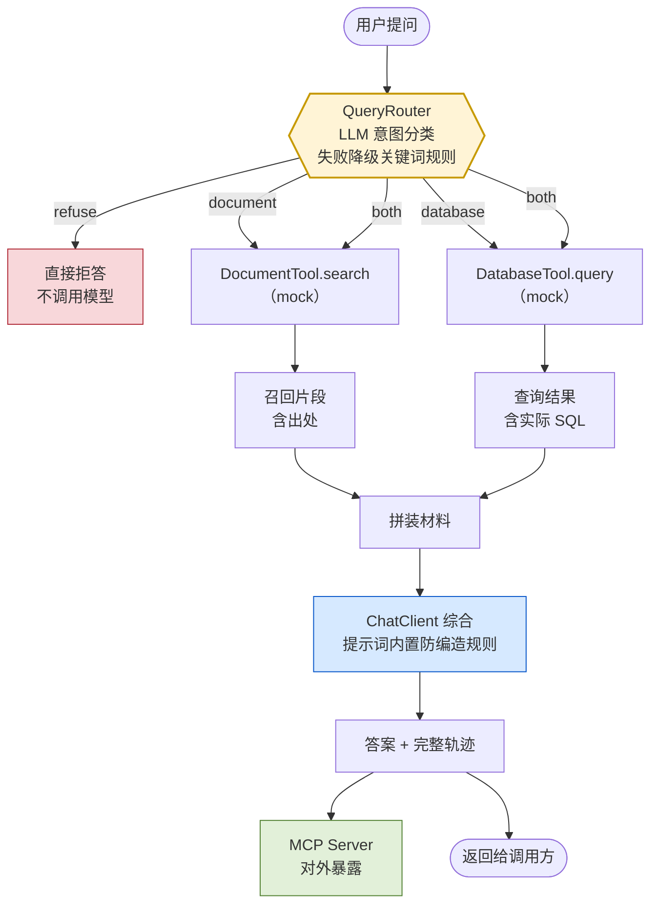
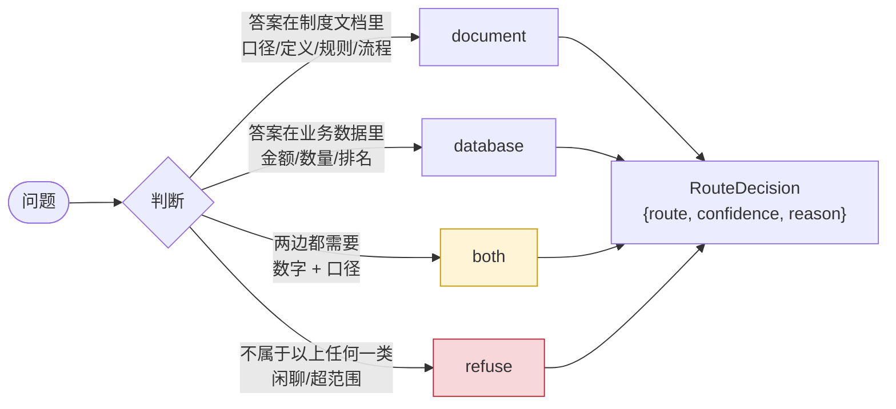
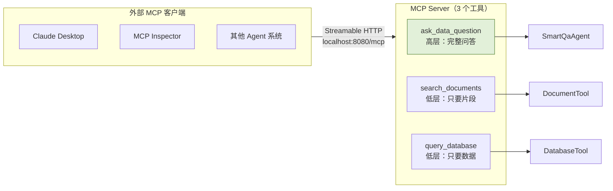

# 系统架构

> 迭代 11（检查点①）
> 这张图是**当前实际接线状态**，不是设想。下面单独列了「已实现但还没接入」的部分，
> 免得图和代码对不上。

---

## 主链路

**路由的四条分支是这张图的核心。** 别的部分（检索、查库、生成）都是常规工程，
唯独「该走哪条路」这个判断，是开源同类项目里没有的那一块。

---

## 路由决策的形状

**`both` 和 `refuse` 是四值设计里真正有价值的两个。**

二选一的题，模型永远能选出一个答案（哪怕答案是错的）；
四选一的题，它有了说「这题两边都要」和「这题不该用我」的出口。

`reason` 字段不是装饰——迭代 25 分析路由失败时，它是唯一能看出「模型当时怎么想的」的抓手。

---

## 已实现但还没接入主链路

这两块代码写好了、单独跑过，但**目前不在上面那张图的链路里**。
写在这里是为了让图和代码对得上，也给它们标好接入时间点。

| 组件 | 状态 | 计划接入 |
|---|---|---|
| `ContextCompactor`（迭代 4） | 已实现、有独立演示 | 多轮对话时接入。目前 Agent 是单轮的，每次问答独立 |
| `ToolRegistry` 权限门（迭代 5） | 已实现、有独立演示 | 迭代 21。目前两个工具都是只读的，还没有需要拦截的危险操作 |
| `Plan` 可校验计划（迭代 5） | 已实现、有独立演示 | 待定。目前的任务复杂度还不需要显式规划 |

**为什么不在 迭代 11 一次性全接上：** 那会把检查点变成一次大重构，
而检查点的意义是「确认主干能跑通」。这两块各自有明确的接入时机，
现在硬接反而会让链路变复杂、难调试。

---

## 数据契约

三个接口的形状定死在 迭代 8，后面换实现不改调用方：

| 契约 | 关键字段 | 为什么这么定 |
|---|---|---|
| `RouteDecision` | `route` / `confidence` / `reason` | 四值而非两值；`reason` 是失败分析的唯一抓手 |
| `Chunk` | `id` / `content` / `source` / `score` | `source` 让答案能标出处，用户才有东西可核实 |
| `QueryResult` | **`sql`** / `columns` / `rows` / `rowCount` | **`sql` 是关键**——它让「有没有真查过」可验证，是 迭代 21 防线的落点 |

---

## 对外暴露

分两个层次对外，是因为调用方的需求不同：想直接用就用高层，想自己编排就用低层。

---

## 换实现的时间表

下面这些位置**接口不变、只换实现**，这也是从 迭代 8 起就把契约抽出来的目的：

| 位置 | 现在 | 换成 | 哪天 |
|---|---|---|---|
| `DocumentTool` | 关键词粗匹配 | pgvector 向量检索 → 混合检索 → 重排 | 迭代 14 / 16 / 17 |
| `DatabaseTool` | 关键词模板 | 真实 Text2SQL + 安全边界 | 迭代 18 / 21 |
| 查询改写 | 无 | 查询重写 / 意图识别 | 迭代 22 |
| RAG 组装 | 手写 | 模块化 pipeline（五件套） | 迭代 26 |
